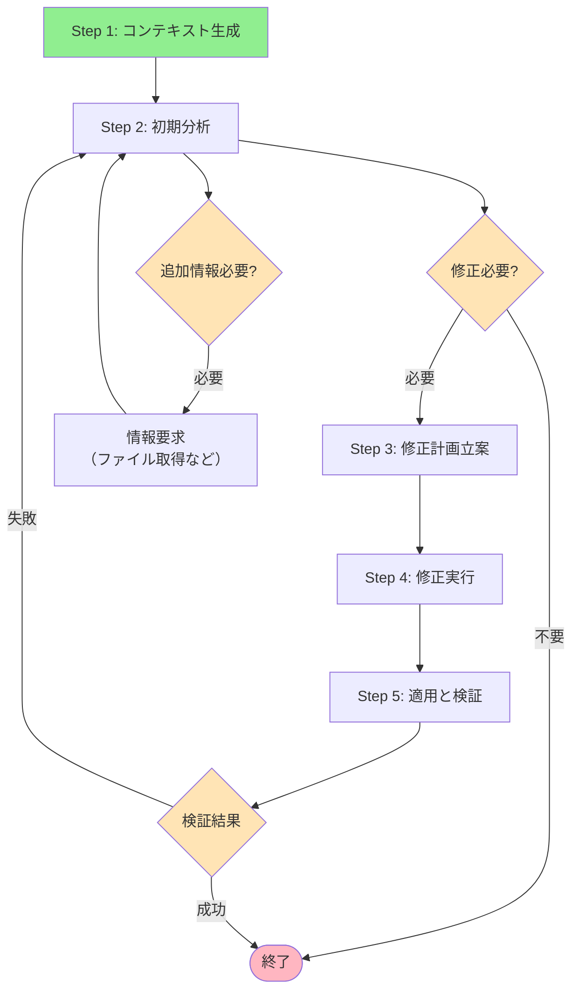

```mermaid
graph TD
    A[Step 1: コンテキスト生成] --> B[Step 2: 初期分析]
    
    B --> C{修正必要?}
    C -->|不要| End([終了])
    C -->|必要| D[Step 3: 修正計画立案]
    
    D --> E[Step 4: 修正実行]
    E --> F[Step 5: 適用と検証]
    
    F --> G{検証結果}
    G -->|成功| End
    G -->|失敗| B
    
    B --> H{追加情報必要?}
    H -->|必要| I[情報要求<br/>（ファイル取得など）]
    I --> B
    
    style A fill:#90EE90
    style End fill:#FFB6C1
    style C fill:#FFE4B5
    style G fill:#FFE4B5
    style H fill:#FFE4B5
```