# gRPC LLMエージェントによる自動バグ修正システム設計ドキュメント

---

## 1. プロジェクト目的

gRPCベースのマイクロサービスにおいて、`.proto`ファイルの変更に起因するバグを  
LLMエージェントが自動で検出・修正するシステムを構築する。

---

## 2. コア課題と基本方針

- gRPCは多言語対応のため、従来の静的解析による依存関係追跡はコスト・保守性の面で非現実的。
- LLMを「自律的なエージェント」として活用し、
  - 高品質なコンテキストを戦略的に与える
  - 「Think→Plan→Act」サイクルを強制
  - 必要に応じて追加情報を動的に取得できる
  という設計思想を採用。

---

## 3. システム構成

- **コンテキスト生成パイプライン**  
  コミット前後のスナップショットから、LLMが初期分析に使う構造化JSON（master_context.json）を生成。
- **LLM対話ループ**  
  LLMのリクエストに応じて情報提供・修正適用を繰り返すステートフルな制御プログラム。

---

## 4. 詳細ワークフロー

### mermaid

```mermaid
graph TD
    A[開始] --> B{初期コンテキスト準備};
    B --> C[システム: LLMへ初期情報送信<br>&#40;proto変更差分, 疑わしいファイル情報など&#41;];
    C --> D[LLM: 分析・思考・計画<br>&#40;%_Thought_%, %_Plan_%&#41;];
    D --> E{LLMの判断};

    E -- "%_Reply Required_%" (追加情報が必要) --> F[システム: 要求された情報を解析];
    F --> G{要求タイプは？};
    G -- "FILE_CONTENT" --> H[システム: ファイル内容を取得];
    G -- "DIRECTORY_LISTING" --> I[システム: ディレクトリ構造を取得];
    H --> J[システム: 取得情報をLLMへ送信];
    I --> J;
    J --> K[LLM: 新情報を元に再分析・計画更新];
    K --> E;

    E -- "%_Modified_%" (コード修正案を生成) --> L[システム: 修正差分&#40;diff&#41;を解析];
    L --> M[システム: 修正を&#40;仮想的に&#41;適用];
    M --> N{適用結果/状態は？};
    N -- "成功 / 次のステップへ" --> O[システム: 適用結果と次の指示をLLMへ送信];
    O --> P[LLM: 計画の次のステップ実行 or 再評価];
    P --> E;
    N -- "エラー / 問題あり" --> Q[システム: エラー情報をLLMへ送信];
    Q --> R[LLM: エラーに基づき再分析・計画修正];
    R --> E;

    E -- "%%_Fin_%%" (タスク完了) --> S[終了];

    classDef default fill:#f9f,stroke:#333,stroke-width:2px,color:black;
    classDef process fill:#bbf,stroke:#333,stroke-width:2px,color:black;
    classDef decision fill:#ff9,stroke:#333,stroke-width:2px,color:black;
    classDef io fill:#9f9,stroke:#333,stroke-width:2px,color:black;
    classDef startend fill:#fcc,stroke:#333,stroke-width:2px,color:black;

    class A,S startend;
    class B,C,F,H,I,J,L,M,O,Q process;
    class D,K,P,R io;
    class E,G,N decision;
```



### 4.1 コンテキスト生成

- **入力**: premerge/mergeディレクトリ
- **出力**: master_context.json（directory_structure, categorized_changed_files）
- **主な処理**
  - .proto差分抽出
  - 変更ファイルリストのノイズ除去
  - 「疑わしいファイル」選定（ファイル名・proto関連語・変更有無によるスコアリング）
  - 上位N件のpre-change内容を抽出
  - 重要ファイル周辺のディレクトリ構造をBFSでスニペット化し、最終的に統合

### 4.2 LLM対話ループ

- **プロンプト設計**
  - 初期プロンプト、追加情報、修正成功/失敗時のテンプレートを使い分け
- **タグベース制御**
  - `%_Thought_%`（分析）、`%_Plan_%`（計画）、`%_Reply Required_%`（追加情報要求）、`%_Modified_%`（修正案）、`%%_Fin_%%`（完了）で分岐
- **ループ処理**
  - LLMのタグに応じて情報提供・修正適用・エラー対応を繰り返し、`%%_Fin_%%`で終了

---

## 5. 技術的特徴

- 静的解析に頼らず、LLMの動的探索力＋高品質コンテキストで多言語gRPCの修正を実現
- 「疑わしいファイル」選定のスコアリングは、proto差分の語彙を活用し、静的解析不要で関連性を高めている
- LLMの出力をタグで制御し、状態遷移を明確化した堅牢な対話ループ設計
- master_context.jsonの設計がLLMパフォーマンスの鍵

---

## 6. データセット構成例

```
dataset/
└── PROJECT_NAME/
    └── pullrequest/ または issue/
        └── PULLREQUEST_NAME/
            ├── premerge_xxx/         # コミット前のスナップショット（LLM修正フローの入力）
            ├── merge_xxx/            # コミット後のスナップショット（diff計算や評価用）
            ├── commit_snapshot_xxx/  # その他のスナップショット（必要に応じて利用）
            ├── 01_proto.txt
            ├── 02_protoFileChanges.txt
            ├── 03_fileChanges.txt
            ├── 04_surroundedFilePaths.txt
            └── 05_suspectedFiles.txt
```

- **PROJECT_NAME**: 対象プロジェクト名
- **pullrequest/issue**: PRかIssueかの区分
- **PULLREQUEST_NAME**: PRやIssueのタイトルやID
- **premerge_xxx/**: LLMエージェントが修正対象とする入力ディレクトリ
- **merge_xxx/**: 修正後の状態（diffや自動評価で利用）
- **commit_snapshot_xxx/**: その他のスナップショット（任意）
- **01〜05_xxx.txt**: 各種コンテキスト・差分・疑わしいファイルリスト等

---

## 7. 実装状況

- TypeScript/ESMでllmFlowController, llmFlowBatchRunner等の主要モジュールを実装
- バッチ処理・ログ出力・プロンプト管理・タグ解析・diff適用など、autoResponser.jsの機能を全て移行・拡張済み

---
