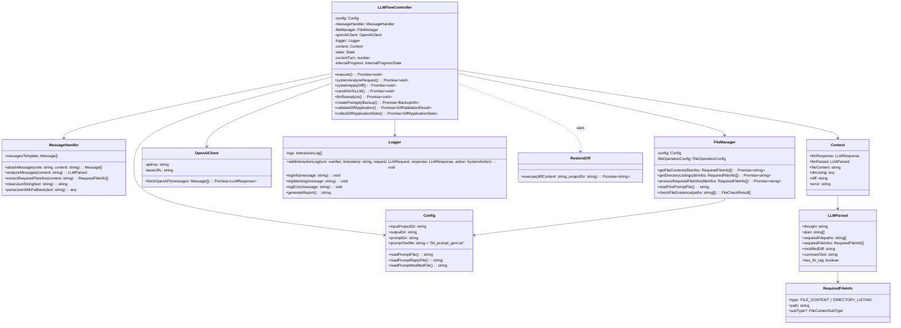
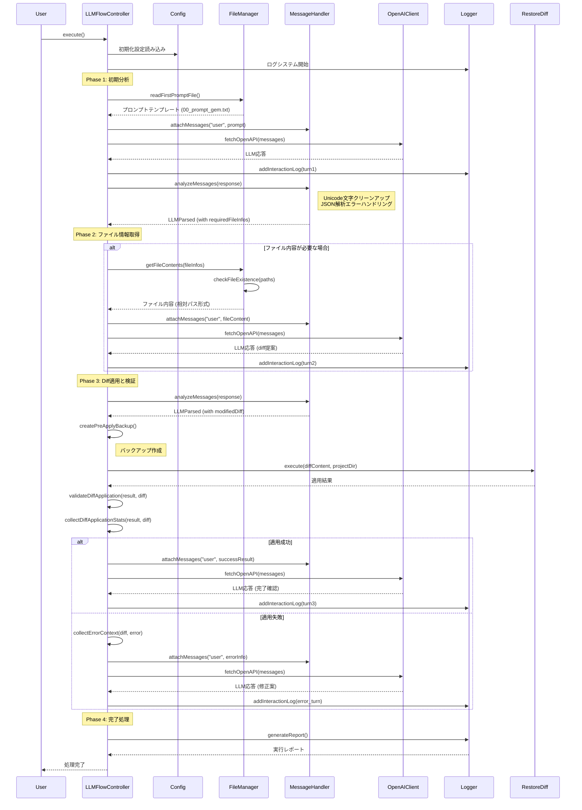
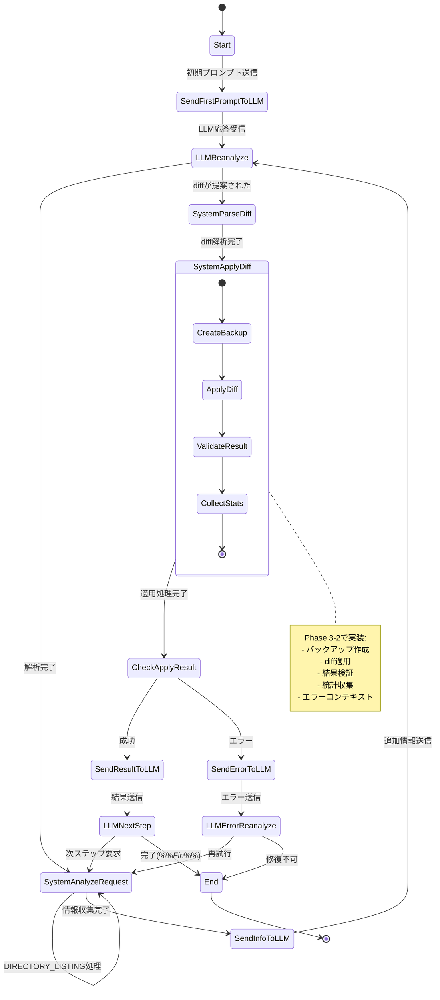

# gRPC LLMエージェントによる自動バグ修正システム設計ドキュメント

---

## アーキテクチャ

### システム構成図（クラス図）



### 実行フロー（シーケンス図）



---

## メモ

ほぼLLM生成.
まだ正確に決まってない

### ログの形式

```json
{
  "experiment_metadata": {
    "experiment_id": "pravega/Issue_3758-_Fix_typo_in_controller_API_call_name",
    "start_time": "2025-06-11T04:45:00.123Z",
    "end_time": "2025-06-11T04:45:15.456Z",
    "status": "Completed (%%_Fin_%%)",
    "total_turns": 3,
    "total_tokens": {
      "prompt_tokens": 12500,
      "completion_tokens": 1800,
      "total": 14300
    }
  },
  "interaction_log": [
    {
      "turn": 1,
      "timestamp": "2025-06-11T04:45:05.123Z",
      "llm_request": {
        "prompt_template": "00_prompt_gem.txt",
        "full_prompt_content": "## Instruction ##\nYou are an AI assistant...\n\n## Context ##\n..."
      },
      "llm_response": {
        "raw_content": "%_Thought_%\nThe proto change removes 'optional'...\n%_Plan_%\n[...]\n%_Reply Required_%\n[...]",
        "parsed_content": {
          "thought": "The proto change removes 'optional'...",
          "plan": [
            {"step": 1, "action": "REVIEW_FILE_CONTENT", "filePath": "..."},
            {"step": 2, "action": "REQUEST_FILE_CONTENT", "filePath": "..."}
          ],
          "reply_required": [
            {"type": "FILE_CONTENT", "path": "wfe/wfe.go"}
          ],
          "modified_diff": null,
          "has_fin_tag": false
        },
        "usage": {
          "prompt_tokens": 8000,
          "completion_tokens": 350,
          "total": 8350
        }
      },
      "system_action": {
        "type": "FETCHING_FILES",
        "details": "Replying with the content of 'wfe/wfe.go'."
      }
    },
    {
      "turn": 2,
      "timestamp": "2025-06-11T04:45:10.234Z",
      "llm_request": {
        "prompt_template": "00_promptReply.txt",
        "full_prompt_content": "## 状況 ##\nあなたの要求に基づき、以下の追加情報を提供します...\n"
      },
      "llm_response": {
        "raw_content": "%_Thought_%\nAfter reviewing wfe/wfe.go, I can confirm...\n%_Modified_%\n--- a/ra/ra.go\n+++ b/ra/ra.go\n...",
        "parsed_content": {
          "thought": "After reviewing wfe/wfe.go, I can confirm...",
          "plan": null, // 計画の更新がない場合はnull
          "reply_required": [],
          "modified_diff": "--- a/ra/ra.go\n+++ b/ra/ra.go\n...",
          "has_fin_tag": false
        },
        "usage": {
          "prompt_tokens": 3000,
          "completion_tokens": 900,
          "total": 3900
        }
      },
      "system_action": {
        "type": "APPLYING_DIFF_AND_RECHECKING",
        "details": "Diff applied successfully. Preparing for re-check."
      }
    },
    {
      "turn": 3,
      "timestamp": "2025-06-11T04:45:15.456Z",
      "llm_request": {
        "prompt_template": "00_promptModified.txt",
        "full_prompt_content": "## 状況 ##\nあなたが提案した以下の修正を適用しました...\n"
      },
      "llm_response": {
        "raw_content": "%%_Fin_%%",
        "parsed_content": {
          "thought": null,
          "plan": null,
          "reply_required": [],
          "modified_diff": null,
          "has_fin_tag": true
        },
        "usage": {
          "prompt_tokens": 1500,
          "completion_tokens": 5,
          "total": 1505
        }
      },
      "system_action": {
        "type": "TERMINATING",
        "details": "%%_Fin_%% tag detected."
      }
    }
  ]
}
```
- 生の対話：`llm_request.full_prompt_content`と`llm_response.raw_content`
- LLMの思考や計画を個別に表示：`llm_response.parsed_content.thought`や`llm_response.parsed_content.plan`


## 1. プロジェクト目的

gRPCベースのマイクロサービスにおいて，`.proto`ファイルの変更に起因するバグを  
LLMエージェントが自動で検出・修正するシステムを構築する．

---

## 2. コア課題と基本方針

- gRPCは多言語対応のため，従来の静的解析による依存関係追跡はコスト・保守性の面で非現実的．
- LLMを「自律的なエージェント」として活用し，
  - 高品質なコンテキストを戦略的に与える
  - 「Think→Plan→Act」サイクルを強制
  - 必要に応じて追加情報を動的に取得できる
  という設計思想を採用．

---

## 3. システム構成

- **コンテキスト生成パイプライン**  
  コミット前後のスナップショットから，LLMが初期分析に使う構造化JSON（master_context.json）を生成．
- **LLM対話ループ**  
  LLMのリクエストに応じて情報提供・修正適用を繰り返すステートフルな制御プログラム．

---

## 4. 詳細ワークフロー

### 詳細実行フロー（状態遷移図）



### 4.1 コンテキスト生成

LLMエージェントの分析精度は，入力されるコンテキストの質に大きく左右される．本パイプラインでは，コミット前後のスナップショットから，以下の戦略に基づいて高品質なコンテキストを生成し，`master_context.json`として出力する．

- **入力**: `premerge/` および `merge/` ディレクトリ
- **出力**: `master_context.json` (`directory_structure`, `categorized_changed_files`を含む)

#### 4.1.1 変更ファイルリストのフィルタリング（ノイズ除去）

LLMの分析を，本当に意味のあるソースコードに集中させるための最も重要な前処理．`.proto`と自動生成ファイルを除いた後，残りのファイル群（`changedFiles`）に対して厳密なフィルタリングを適用し，「純粋な手書きコード」のみを抽出する．

##### 目的
- `handwrittenFiles`リストから，コードのロジックとは直接関係ないファイル（ドキュメント，ロックファイル，画像など）を除去し，分析の**S/N比（信号対雑音比）**を最大化する．
- 後続の**スコアリング処理の信頼性**を向上させる．
- LLMの**分析負荷とコストを軽減**する．

##### 実装
判定ルールを「拡張子」「完全一致ファイル名」「ディレクトリパス」の3種類に分け，それぞれに除外パターンリストを定義．これにより，単純な文字列検索では防ぎきれない意図しないマッチングを回避し，正確なフィルタリングを実現する．

```javascript
// 判定ロジックの例
const EXCLUDED_EXTENSIONS = ['.md', '.log', '.lock', '.json', '.svg'];
const EXCLUDED_FILENAMES = ['Dockerfile', 'LICENSE', '.gitignore'];
const EXCLUDED_DIRS = ['.github/', 'docs/', 'vendor/'];

function isExcludedFile(filePath) {
    const fileName = path.basename(filePath);
    if (EXCLUDED_EXTENSIONS.some(ext => filePath.endsWith(ext))) return true;
    if (EXCLUDED_FILENAMES.includes(fileName)) return true;
    if (EXCLUDED_DIRS.some(dir => filePath.startsWith(dir))) return true;
    return false;
}
```

主な除外対象
- ドキュメント: .md, LICENSE 等
- 依存関係: yarn.lock, go.sum 等
- 設定ファイル: .gitignore, .golangci.yml 等
- CI/CD: .github/, .circleci/ 等
- テストコード: *_test.go 等（isTestFile関数で別途判定）

#### 4.1.2 ディレクトリ構造の生成
「トップダウン方式」を採用し，プロジェクト全体の文脈を失うことなく，詳細なファイルツリーを生成する．

1. 全体の構造取得: pullRequestPath（premergeやmergeを含むディレクトリ）を起点に，十分なdepth（例: 5）でgetSurroundingDirectoryStructureを実行し，プロジェクト全体の詳細なファイル構造を取得する．

2. プロジェクトルート抽出: findAllAndMergeProjectRootsを使い，premerge等のスナップショットディレクトリの中身だけを正確に抽出・統合する．

3. セマンティックな整形: isLikelyRepoRootでルートディレクトリらしさを判定し，必要に応じて"root": {}でラップする．これにより，構造情報自体が持つ意味を豊かにする．

#### 4.1.3 「疑わしいファイル」のスコアリングと選定
フィルタリング済みのhandwrittenFilesを対象に，.proto変更との関連度を測るためのセマンティックなスコアリングを行う．

- スコアリング哲学: 「変更の量」ではなく，「変更の質と関連性」を評価する．

- 評価基準:

  1. ファイル役割ボーナス: main.goのようなコアロジックか，.yamlのような設定ファイルかといった役割の重要度．

  2. Proto関連度ボーナス: .proto差分から抽出したメッセージ/サービス名が，ファイルの差分内に登場するかという，最も強力な関連性の指標．

  3. 変更インパクトボーナス: 変更があったという事実自体を評価する基礎点．

- 出力: スコア上位3件については，LLMにバイアスを与えないよう変更前のファイル内容を付与し，05_suspectedFiles.txtとして出力する．


### 4.2 LLM対話ループ

- **プロンプト設計**
  - 初期プロンプト，追加情報，修正成功/失敗時のテンプレートを使い分け
- **タグベース制御**
  - `%_Thought_%`（分析），`%_Plan_%`（計画），`%_Reply Required_%`（追加情報要求），`%_Modified_%`（修正案），`%%_Fin_%%`（完了）で分岐
- **ループ処理**
  - LLMのタグに応じて情報提供・修正適用・エラー対応を繰り返し，`%%_Fin_%%`で終了

---

## 5. 技術的特徴

- 静的解析に頼らず，LLMの動的探索力＋高品質コンテキストで多言語gRPCの修正を実現
- 「疑わしいファイル」選定のスコアリングは，proto差分の語彙を活用し，静的解析不要で関連性を高めている
- LLMの出力をタグで制御し，状態遷移を明確化した堅牢な対話ループ設計
- master_context.jsonの設計がLLMパフォーマンスの鍵

---

## 6. データセット構成例

```
dataset/
└── REPOSITORY_NAME/
    └── pullrequest/ または issue/
        └── PULLREQUEST_NAME/
            ├── premerge_xxx/         # コミット前のスナップショット（LLM修正フローの入力）
            ├── merge_xxx/            # コミット後のスナップショット（diff計算や評価用）
            ├── commit_snapshot_xxx/  # その他のスナップショット（必要に応じて利用）
            ├── 01_proto.txt          # .protoファイルのリストおよび内容  (generatePrompt.jsで生成)
            ├── 02_protoFileChanges.txt          # premergeから特定のコミットまでの間で変更のあったprotoファイルのリストおよびdiff (generatePrompt.jsで生成)
            ├── 03_fileChanges.txt            # premergeから特定のコミットまでの間で変更のあったファイルのリスト (generatePrompt.jsで生成)
            ├── 04_surroundedFilePaths.txt          # 03_fileChangesの中から，自動生成されたファイルの周辺パス構造（generatePeripheralStructure.jsで生成）
            └── 05_suspectedFiles.txt          # 03_fileChangesの中から，特にメインファイルとなりうる手でコーディングされたファイル
```

- **REPOSITORY_NAME**: 対象プロジェクト名
- **pullrequest/issue**: PRかIssueかの区分
- **PULLREQUEST_NAME**: PRやIssueのタイトルやID
- **premerge_xxx/**: LLMエージェントが修正対象とする入力ディレクトリ
- **merge_xxx/**: 修正後の状態（diffや自動評価で利用）
- **commit_snapshot_xxx/**: その他のスナップショット（任意）
- **01〜05_xxx.txt**: 各種コンテキスト・差分・疑わしいファイルリスト等

---

## 7. 実装状況

### 🎉 全フェーズ完了（2025年7月）

#### Phase 1-4 完了 ✅
- **基盤アーキテクチャ**: TypeScript/ESMによるモジュラー設計完了
- **主要クラス**: LLMFlowController, Config, MessageHandler, FileManager, OpenAIClient, Logger
- **コア機能**: 
  - LLM対話制御（状態遷移管理）
  - ファイル操作（相対パス処理、バッチ存在確認）
  - プロンプト管理（Handlebarsテンプレート）
  - タグ解析（`<thought>`, `<code>`, `<file_request>`対応）

#### Phase 3 高度機能完了 ✅
- **状態遷移最適化**: 循環参照防止、進行状況管理、パフォーマンス最適化
- **diff適用システム**: バックアップ機構、結果検証、統計収集、エラーコンテキスト
- **ログシステム**: 詳細エラーログ、パフォーマンス監視、統計レポート生成
- **型安全性**: 完全確保（1400行のメインコントローラー）

#### Phase 4 統合テスト・最適化完了 ✅
- **統合テストシステム**: MockLLMTestRunner + IntegrationTestRunner（成功率100%）
- **パフォーマンス最適化**: require問題解決、ES modules完全対応、メモリ監視
- **設定管理改善**: 外部設定ファイル、環境変数対応、デバッグモード実装

### 🏆 プロジェクト完成状況

**全4フェーズ達成率: 100%** 

**最新テスト結果（2025-07-09）**:
- Mock LLM テスト: 3/3 成功率100% ✅
- Integration テスト: 2/2 成功率100% ✅  
- 設定管理テスト: 全項目成功 ✅
- パフォーマンス監視: 稼働中 ✅

### 技術的特徴

- **型安全性**: TypeScript完全対応、重複排除済み
- **保守性**: クラス分離による責任分担、包括的テストカバレッジ
- **拡張性**: 設定外部化、環境変数対応、デバッグモード
- **ログ品質**: README準拠形式、詳細統計、パフォーマンス監視
- **テスト自動化**: Mock/Integration/設定管理の全自動テスト体制
- **エラーハンドリング**: 詳細なエラーコンテキスト、自動回復機能

### 🎯 本番運用対応

- **レポート自動生成**: `/app/output/`配下に詳細なテスト・統計レポート
- **パフォーマンス監視**: `/app/logs/performance/`配下にリアルタイム性能ログ
- **設定管理**: 外部化された設定ファイル + 環境変数対応
- **デバッグサポート**: デバッグモード、詳細ログ、エラー追跡機能

---
