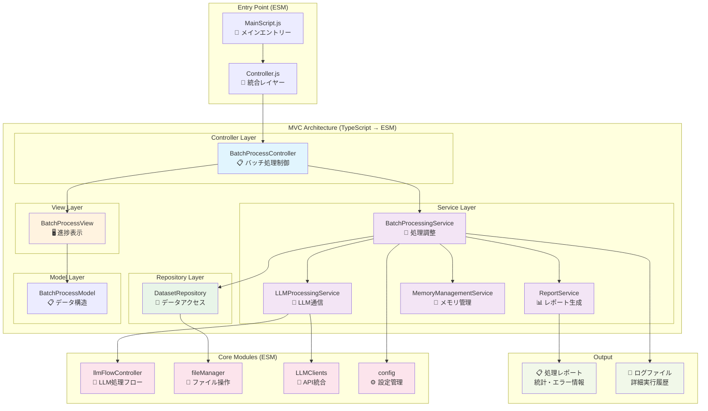
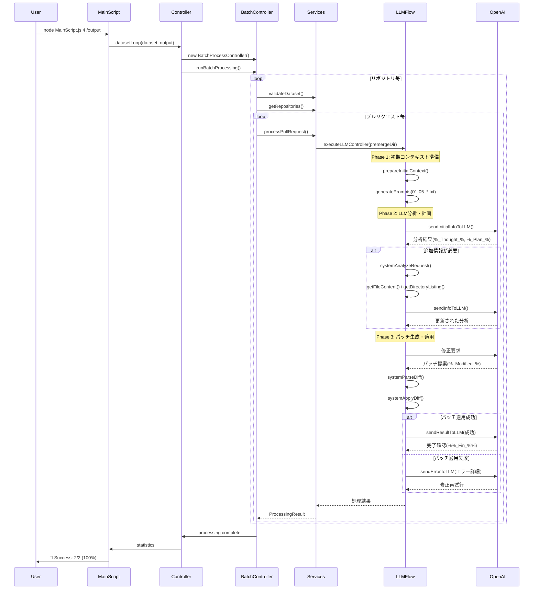
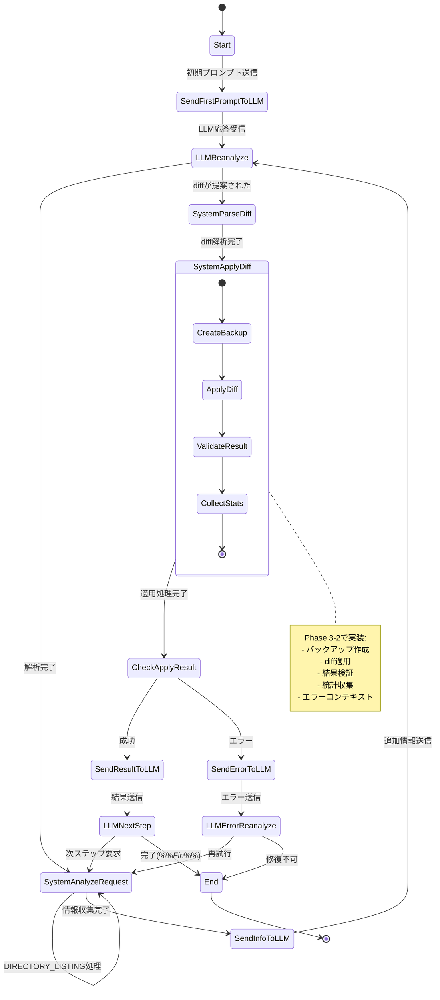

# gRPC LLMエージェントによる自動バグ修正システム

**最新アーキテクチャ**: ESM形式統一 + 完全MVC実装 (2025年9月更新)

---

## 📁 プロジェクト構造 (ESM統一後)

```
/app/
├── src/                          # TypeScript ソースコード (ESM)
│   ├── controllers/              # Controller層 - リクエスト制御
│   │   └── BatchProcessController.ts    # メインバッチ処理コントローラー
│   ├── Service/                  # Service層 - ビジネスロジック
│   │   ├── BatchProcessingService.ts    # バッチ処理調整サービス  
│   │   ├── LLMProcessingService.ts      # LLM処理とリトライ制御
│   │   ├── ReportService.ts             # エラーと統計レポート生成
│   │   └── MemoryManagementService.ts   # メモリ監視とGC管理
│   ├── Repository/               # Repository層 - データアクセス
│   │   └── DatasetRepository.ts         # ファイルシステム操作抽象化
│   ├── views/                    # View層 - プレゼンテーション
│   │   └── BatchProcessView.ts          # 進捗表示とレポート出力
│   ├── models/                   # Model層 - データ構造
│   │   └── BatchProcessModel.ts         # バッチ処理データモデル
│   ├── types/                    # 型定義
│   │   └── BatchProcessTypes.ts         # 共通型定義とインターフェース
│   ├── modules/                  # コアモジュール (ESM化済み)
│   │   ├── llmFlowController.ts  # LLM処理フローコントローラー
│   │   ├── config.ts            # 設定管理とvalidation
│   │   ├── messageHandler.ts    # LLMメッセージ処理
│   │   ├── fileManager.ts       # ファイルI/O操作
│   │   ├── openAIClient.ts      # OpenAI API クライアント
│   │   ├── geminiLLMClient.ts   # Gemini API クライアント
│   │   ├── llmClientFactory.ts  # LLMクライアント統合管理
│   │   ├── generatePeripheralStructure.ts # ディレクトリ構造生成
│   │   ├── restoreDiff.ts       # 差分復元処理
│   │   └── logger.ts            # ログ管理システム
│   ├── utils/                    # 共通ユーティリティ
│   │   ├── generatePrompt.ts     # プロンプト生成ロジック
│   │   ├── autoResponser.ts      # 自動応答システム
│   │   └── timeUtils.ts          # 時間関連ユーティリティ
│   └── Controller/               # 統合コントローラー (ESM)
│       └── Controller.js         # MVC統合エントリーポイント
├── scripts/                      # 実行スクリプト (ESM)
│   ├── MainScript.js            # 🎯 メインエントリーポイント (MVC)
│   └── README_MainScript.md     # メインスクリプト使用説明
├── dist/js/                      # TypeScript → JavaScript (ESM出力)
│   ├── controllers/              # コンパイル済みController
│   ├── Service/                  # コンパイル済みService  
│   ├── Repository/               # コンパイル済みRepository
│   ├── views/                    # コンパイル済みView
│   ├── models/                   # コンパイル済みModel
│   ├── modules/                  # コンパイル済みコアモジュール
│   └── utils/                    # コンパイル済みユーティリティ
├── config/                       # 設定ファイル
├── dataset/                      # テストデータセット
│   └── test/                     # 小規模テストデータ
├── docs/                         # プロジェクトドキュメント
├── evaluation/                   # 評価システム（独立）
├── patchEvaluation/             # パッチ評価システム（独立）
├── logs/                         # 実行ログ + パフォーマンス
├── output/                       # 処理結果出力
├── package.json                  # Node.js設定 ("type": "module")
├── tsconfig.json                 # TypeScript設定 (ESM出力)
├── .env                         # 環境変数設定
└── README.md                     # このファイル
```

### 🚀 開発・実行フロー (ESM統一)

1. **開発**: `src/` でTypeScriptコードを編集
2. **コンパイル**: `npm run build` または VS Code Task で自動コンパイル
3. **実行**: 完全MVC実装
   ```bash
   # メイン実行方法
   node scripts/MainScript.js [データセット番号] [出力ディレクトリ]
   
   # 例: テストデータセットで実行
   node scripts/MainScript.js 4 /tmp/output
   ```

## 🏗️ アーキテクチャ (ESM + MVC)

### 🎯 システム構成図 (完全MVC + ESM)



### 📊 実行フロー



### 🔄 パッチ生成フローの詳細

#### Phase 1: 初期コンテキスト準備
MainScript実行時、各プルリクエストに対して以下のコンテキストファイルが自動生成されます：

| ファイル | 内容 | 生成基準 |
|:--|:--|:--|
| `01_proto.txt` | Protoファイル情報 | 変更・依存関係・その他のprotoファイル |
| `02_protoFileChanges.txt` | Proto差分 | premerge/merge間の.proto変更 |
| `03_fileChanges.txt` | 全変更ファイル | 変更されたファイルパス一覧 |
| `04_surroundedFilePath.txt` | プロジェクト構造 | 5階層ディレクトリ + ファイル分類 |
| `05_suspectedFiles.txt` | 疑わしいファイル | スコアリング上位3件の変更前内容 |

#### Phase 2: LLM分析・計画サイクル
```
1. 初期プロンプト送信 → LLM分析(%_Thought_%)
2. 実行計画生成(%_Plan_%)
3. 追加情報要求(%_Reply Required_%)
   ├── FILE_CONTENT: 特定ファイルの内容取得
   ├── DIRECTORY_LISTING: ディレクトリ構造詳細
   └── その他の分析要求
4. 情報追加 → 再分析サイクル
```

#### Phase 3: パッチ生成・適用・検証
```
1. パッチ提案(%_Modified_%)
2. Diff解析・バリデーション
3. バックアップ作成
4. パッチ適用実行
5. 適用結果検証
   ├── 成功 → LLMに成功結果送信
   └── 失敗 → エラーコンテキスト収集・LLMに送信
6. 完了確認(%%_Fin_%%) または 修正再試行
```

#### パッチ品質検証基準
| 検証項目 | 必須 | 説明 |
|:--|:--:|:--|
| %%_Fin_%%タグ存在 | ✅ | 処理完了の明確な指示 |
| JSON構造妥当性 | ✅ | パース可能な応答形式 |
| 修正内容存在 | ✅ | 実際のコード変更が含まれる |
| 構文有効性 | 推奨 | 生成されたコードの構文チェック |
| コンテキスト適合性 | 推奨 | 元の問題に対する適切な修正 |

#### リトライ・エラーハンドリング
- **最大リトライ回数**: 3回（設定可能）
- **指数バックオフ**: 1秒→2秒→4秒の待機時間
- **リトライ対象エラー**: ネットワーク、API制限、一時的障害
- **リトライ除外エラー**: 構文エラー、認証エラー、形式エラー

#### エラーコンテキストの詳細内容

パッチ適用が失敗した場合、LLMに送信される「エラーコンテキスト」には以下の情報が含まれます：

##### 1. 基本エラー情報
```typescript
{
  message: string,           // 基本エラーメッセージ
  timestamp: string,         // エラー発生時刻
  phase: 'DIFF_APPLICATION' // 処理フェーズ
}
```

##### 2. 詳細エラーコンテキスト（ErrorContext）
| 項目 | 内容 | 例 |
|:--|:--|:--|
| **diffPreview** | 失敗したdiffの最初の100文字 | `--- a/main.go\n+++ b/main.go\n@@ -15,7 +15,7 @@\n package main\n\n import (\n-\t"context"...` |
| **affectedFiles** | 影響を受けるファイルパス一覧 | `["main.go", "service.yaml", "client.py"]` |
| **systemState** | システム状態スナップショット | `"Phase: DIFF_APPLICATION, Turn: 3, Errors: 1"` |
| **possibleCauses** | 推定される原因リスト | `["File not found - target file may not exist", "Line number mismatch - file may have been modified"]` |

##### 3. 推定原因の自動判定ロジック
| エラータイプ | 検出条件 | 推定原因 |
|:--|:--|:--|
| **ファイル不存在** | `ENOENT` を含む | "File not found - target file may not exist" |
| **権限エラー** | `EACCES` を含む | "Permission denied - insufficient file system permissions" |
| **diff形式エラー** | `diff` or `patch` を含む | "Invalid diff format or corrupted patch data" |
| **行番号不一致** | `line` を含む | "Line number mismatch - file may have been modified" |
| **その他** | 上記以外 | "Unknown error - check diff format and file accessibility" |

##### 4. LLMへの送信形式例
```
エラーが発生しました: {
  "message": "Error applying diff: patch failed at line 23 in main.go",
  "errorContext": {
    "diffPreview": "--- a/main.go\n+++ b/main.go\n@@ -15,7 +15,7 @@\n package main\n\n import (\n-\t\"context\"...",
    "affectedFiles": ["main.go", "service.yaml"],
    "systemState": "Phase: DIFF_APPLICATION, Turn: 3, Errors: 1",
    "possibleCauses": [
      "Line number mismatch - file may have been modified",
      "Invalid diff format or corrupted patch data"
    ]
  },
  "timestamp": "2025-09-17T10:30:35Z",
  "phase": "DIFF_APPLICATION"
}

修正案を再検討してください。

【現在の状況分析】
- 対象ファイル: main.go（23行目周辺でエラー）
- エラータイプ: パッチ適用失敗
- 推定原因: ファイルが既に変更されている可能性
- 影響範囲: main.go, service.yaml

【修正方針の提案】
1. ファイルの現在の状態を確認
2. 行番号ズレを考慮した修正
3. より安全な差分適用方法の検討
```

##### 5. エラー回復戦略
LLMがエラーコンテキストを受け取った後の典型的な回復パターン：

| 戦略 | 適用条件 | アクション例 |
|:--|:--|:--|
| **行番号調整** | Line mismatch エラー | 周辺コンテキストを利用した修正位置の再特定 |
| **ファイル分割** | 複数ファイル同時変更失敗 | 一つずつ順次適用するアプローチに変更 |
| **フォールバック手法** | diff形式エラー | より単純な文字列置換アプローチへ変更 |
| **追加情報要求** | ファイル不存在 | FILE_CONTENT要求で現状確認 |
| **処理中断** | 権限エラー | 修正不可能と判断して安全に終了 |

この包括的なエラーコンテキストにより、LLMは：
- **具体的な失敗原因を理解**
- **影響範囲を把握**  
- **代替アプローチを検討**
- **より適切な修正案を再生成**

することが可能になります。

##### 6. エラーコンテキスト収集プロセス
```typescript
// collectErrorContext()メソッドの処理フロー
1. diffPreviewの生成
   └─ 元のdiffの最初の100文字を抽出

2. 影響ファイルの特定  
   └─ diff内の "---" と "+++" 行からファイルパスを抽出

3. システム状態のスナップショット
   └─ 現在のフェーズ、ターン数、累積エラー数を記録

4. エラータイプ別の原因推定
   ├─ ENOENT → ファイル不存在
   ├─ EACCES → 権限不足  
   ├─ diff/patch → 形式エラー
   ├─ line → 行番号不一致
   └─ その他 → 未知のエラー

5. 詳細ログへの記録
   └─ logDiffApplicationError()で完全なコンテキスト保存
```

この仕組みにより、単純な「エラーが発生しました」ではなく、**診断情報付きの建設的なフィードバック**をLLMに提供し、より効果的な修正再試行を実現しています。

### 🔄 複数ターンにわたる累積パッチの扱い

#### 現在の実装方針: **「最新パッチ上書き方式」**

複数のターンで`%_Modified_%`が提案される場合の処理ルールは以下の通りです：

##### 1. 基本的な上書きルール
```typescript
// llmFlowController.ts の処理ロジック
if (parsed.modifiedDiff && parsed.modifiedDiff.length > 0) {
    // 新しいパッチが提案された場合
    this.state = State.SystemParseDiff;  // 即座に処理開始
}

// systemApplyDiff()での実装
this.context.diff = finalContent;        // 常に最新のdiffで上書き
this.context.error = undefined;          // エラー状態もリセット
```

| ターン | LLM提案 | システム動作 | context.diff の状態 |
|:--:|:--|:--|:--|
| Turn 1 | `%_Modified_%` file_A修正 | 即座にパッチ適用実行 | file_A修正パッチで上書き |
| Turn 2 | `%_Reply Required_%` 追加情報要求 | 情報提供、パッチ適用なし | 前回のfile_A修正パッチ保持 |
| Turn 3 | `%_Modified_%` file_B修正 | 即座にパッチ適用実行 | file_B修正パッチで**完全上書き** |
| Turn 4 | `%%_Fin_%%` 完了宣言 | 処理終了 | 最終的にfile_B修正のみ適用済み |

#### 2. 上書き方式の利点・欠点

##### ✅ 利点
- **シンプルな実装**: 複雑な統合ロジック不要
- **エラー処理が明確**: 失敗時は該当パッチのみ影響
- **LLMの意図反映**: 最新の判断を重視
- **デバッグが容易**: 1つのパッチのみ追跡

##### ⚠️ 欠点・制限事項
- **段階的修正の制約**: Turn 1のfile_A修正がTurn 3で消失
- **作業の重複**: 同じファイルを複数回修正する非効率性
- **意図しない上書き**: LLMが前回の修正を忘れる可能性

#### 3. 実際の動作例

```
Turn 1: LLM提案
%_Modified_%
--- a/main.go
+++ b/main.go
@@ -10,7 +10,7 @@
-    return "old_value"
+    return "new_value"

→ システム: main.go修正を即座に適用

Turn 3: LLM提案  
%_Modified_%
--- a/service.yaml
+++ b/service.yaml
@@ -5,7 +5,7 @@
-  port: 8080
+  port: 9090

→ システム: context.diffを完全上書き
→ 結果: main.goの修正は消失、service.yamlのみ適用
```

#### 4. 累積パッチ方式との比較

| 項目 | 現在の上書き方式 | 累積パッチ方式 |
|:--|:--|:--|
| **実装複雑度** | 低 | 高（マージ競合処理必要） |
| **LLM負荷** | 低（単一パッチ集中） | 高（全体整合性考慮） |
| **エラー処理** | 簡潔 | 複雑（部分失敗対応） |
| **修正範囲** | 明確（最新のみ） | 曖昧（累積効果） |
| **デバッグ** | 容易 | 困難（依存関係追跡） |

#### 5. 現在の設計哲学

**「1ターン1パッチ」原則**: 
```
- LLMは各ターンで完結した修正を提案
- システムは即座に適用・検証
- 成功/失敗を明確にフィードバック
- 次ターンではその結果を踏まえた新たな修正
```

この設計により、**複雑な状態管理を回避**し、**LLMとシステム間の明確な対話**を実現しています。

#### 6. 制限事項への対応策

LLMプロンプトでの明示的な指示：
```
「複数ファイルを修正する場合は、1回の%_Modified_%で全てのファイルを含む統合パッチとして提案してください」
「前回の修正を踏まえる場合は、それらも含めた完全なパッチを再生成してください」
```

これにより、システムの制約をLLM側で吸収し、実用的な修正プロセスを実現しています。

### 🔍 パッチ検証（Validation）の詳細

#### 現在の検証レベル: **「基本的な形式・整合性チェック」**

パッチ適用プロセスにおける検証は以下の2段階で実施されます：

##### 1. 適用前検証（systemParseDiff）
```typescript
// 基本的なDiff形式チェック
- Diff構文の妥当性確認
- ファイルヘッダーの存在確認  
- 最低限の変更内容検証
```

**検証内容**: 現在は**構文チェックのみ**で、実際のビルドやリンターは実行されていません。

##### 2. 適用後検証（validateDiffApplication）

| 検証項目 | 検証内容 | レベル |
|:--|:--|:--:|
| **形式チェック** | diffヘッダー（---/+++）の存在 | 基本 |
| **変更統計** | 追加行・削除行・コンテキスト行の計数 | 基本 |
| **マージ競合検出** | `<<<<<<< HEAD` 等の競合マーカー検索 | 基本 |
| **エンコーディング** | UTF-8形式の妥当性確認 | 基本 |
| **コンテンツ整合性** | 復元内容の空チェック | 基本 |

##### 3. 現在実装されている検証の詳細
```typescript
// validateDiffApplication()の主要チェック
const result: DiffValidationResult = {
    isValid: boolean,        // 全体的な妥当性
    errors: string[],        // 致命的エラー（処理停止）
    warnings: string[],      // 警告（処理継続）
    appliedChanges: number,  // 適用された変更数
    skippedChanges: number   // スキップされた変更数
};

// エラー条件（処理停止）
- マージ競合マーカーの存在
- 不正なUTF-8エンコーディング
- 検証処理自体の例外

// 警告条件（処理継続）
- 変更内容が空のdiff
- コンテキスト行不足
- 復元内容が空（差分ありの場合）
```

#### 🚫 現在実装されていない高度な検証

| 未実装の検証 | 内容 | 効果 |
|:--|:--|:--|
| **構文チェック** | 言語固有のlinter実行 | 構文エラーの早期検出 |
| **ビルド検証** | コンパイル・ビルドコマンド実行 | ビルド失敗の検出 |
| **テスト実行** | 単体・統合テストの自動実行 | 機能退行の検出 |
| **依存関係チェック** | import/include文の整合性 | 未定義参照の検出 |
| **型チェック** | TypeScript/静的型解析 | 型エラーの検出 |

#### 💡 検証機能拡張の提案実装

##### Phase 1: 基本ビルド検証
```typescript
// 提案: validateDiffApplication() 拡張
async validateWithBuild(targetFiles: string[]): Promise<BuildValidationResult> {
    const result = { 
        syntaxValid: false, 
        buildPassed: false, 
        testsPassed: false,
        errors: [],
        warnings: []
    };
    
    // 1. 構文チェック
    for (const file of targetFiles) {
        if (file.endsWith('.go')) {
            await this.runCommand('go vet', file);
        } else if (file.endsWith('.ts')) {
            await this.runCommand('tsc --noEmit', file);
        } else if (file.endsWith('.py')) {
            await this.runCommand('python -m py_compile', file);
        }
    }
    
    // 2. プロジェクトビルド
    const buildCommands = this.detectBuildSystem();
    for (const cmd of buildCommands) {
        const buildResult = await this.runCommand(cmd);
        if (buildResult.exitCode !== 0) {
            result.errors.push(`Build failed: ${buildResult.stderr}`);
            return result;
        }
    }
    
    // 3. テスト実行（オプション）
    if (this.config.testing.integrationTestEnabled) {
        const testResult = await this.runCommand('npm test');
        result.testsPassed = testResult.exitCode === 0;
    }
    
    return result;
}
```

##### Phase 2: 言語別検証サポート
| 言語 | 構文チェック | ビルド | テスト |
|:--|:--|:--|:--|
| **Go** | `go vet`, `golint` | `go build` | `go test` |
| **TypeScript** | `tsc --noEmit` | `npm run build` | `npm test` |
| **Python** | `py_compile`, `flake8` | `pip install -e .` | `pytest` |
| **Java** | `javac` | `mvn compile` | `mvn test` |
| **C++** | `g++ -fsyntax-only` | `make` | `make test` |

##### Phase 3: 設定可能な検証レベル
```json
// config.json 拡張提案
{
  "validation": {
    "enabled": true,
    "level": "full",              // "basic" | "syntax" | "build" | "full"
    "stopOnBuildFailure": true,
    "runTests": false,
    "timeoutMs": 120000,
    "languageSpecific": {
      "go": { "vet": true, "lint": true },
      "typescript": { "strict": true },
      "python": { "flake8": true, "mypy": false }
    }
  }
}
```

#### 🎯 検証機能の段階的導入戦略

1. **Phase 1（基本）**: 構文チェック導入
2. **Phase 2（中級）**: ビルド検証追加  
3. **Phase 3（上級）**: テスト自動実行
4. **Phase 4（完全）**: CI/CD統合

これにより、「構文は正しいが、ビルドは通らない」といった低品質なパッチを早期に検出し、システムの堅牢性を飛躍的に向上させることができます。

## 4. 失敗タイプの詳細分類

### 現状の問題: `%%_Fin_%%`タグ忘れは確実に「失敗」扱い

**疑問**: 完璧なパッチを生成したにもかかわらず、単に`%%_Fin_%%`タグを付け忘れた場合、その試行は「失敗（Failed）」としてカウントされるか？

**回答**: **YES** - 現在の実装では確実に「失敗」として扱われます。

#### 現在の成功判定ロジック（LLMProcessingService.ts）

```typescript
// 成功条件: %%_Fin_%%タグがあり、重大なエラーがない
const isSuccess = hasFinTag && !hasErrors;

console.log(`📊 Processing result for ${pullRequestTitle}:`);
console.log(`   %%_Fin_%% tag: ${hasFinTag ? 'YES' : 'NO'}`);
console.log(`   Has errors: ${hasErrors ? 'YES' : 'NO'}`);
console.log(`   Final result: ${isSuccess ? 'SUCCESS' : 'FAILURE'}`);
```

**厳密な必須条件**:
- **必須**: `%%_Fin_%%`タグの存在
- **除外**: 重大なエラー（JSON parse failed、context length exceeded、Incomplete/Error/Failed status）の不存在

#### 現在の失敗分類の限界

現在の`errorsByType`は非常に粗い分類しかできません：

```typescript
// 現在の統計更新
private updateStatistics(type: 'success' | 'failure' | 'skip', errorType?: string): void {
    switch (type) {
        case 'failure':
            this.statistics.failedPullRequests++;
            if (errorType) {
                this.statistics.errorsByType[errorType] = 
                    (this.statistics.errorsByType[errorType] || 0) + 1;
            }
            break;
    }
}
```

**問題**: `%%_Fin_%%`タグ忘れと実際のコード生成失敗が同じ「ProcessingFailure」として一括処理される

### 提案する改善案: 詳細失敗分類システム

#### 1. 新しい失敗分類体系

```typescript
export interface DetailedFailureTypes {
    // コード生成関連の失敗
    codeGenerationFailures: {
        syntaxErrors: number;           // 構文エラー
        compilationFailures: number;    // コンパイル失敗
        logicErrors: number;            // ロジックエラー
        incompletePatches: number;      // 不完全なパッチ
        invalidDiffs: number;           // 適用不可能なdiff
    };
    
    // プロトコル遵守関連の失敗
    protocolViolations: {
        missingFinTag: number;          // %%_Fin_%%タグ忘れ
        malformedResponse: number;      // 不正な応答フォーマット
        unexpectedTermination: number;  // 予期しない終了
        timeoutViolations: number;      // タイムアウト違反
        tagParsingErrors: number;       // タグ解析エラー
    };
    
    // システム関連の失敗
    systemFailures: {
        apiErrors: number;              // LLM API エラー
        fileSystemErrors: number;       // ファイルシステムエラー
        memoryExhaustion: number;       // メモリ不足
        networkFailures: number;        // ネットワーク障害
        configurationErrors: number;    // 設定エラー
    };
}
```

#### 2. 成功判定ロジックの改良

```typescript
interface ProcessingAnalysis {
    codeQuality: 'excellent' | 'good' | 'poor' | 'failed';
    protocolCompliance: 'compliant' | 'minor_violation' | 'major_violation';
    overallSuccess: boolean;
    failureCategory?: 'code_generation' | 'protocol_violation' | 'system_error';
    specificFailureType?: string;
    warningMessages?: string[];
}

function analyzeProcessingResult(logContent: string, status: string): ProcessingAnalysis {
    const hasFinTag = logContent.includes('%%_Fin_%%');
    const hasValidPatch = extractAndValidatePatch(logContent);
    const hasSystemErrors = checkForSystemErrors(logContent);
    
    // コード品質の評価
    let codeQuality: ProcessingAnalysis['codeQuality'];
    if (hasValidPatch && hasValidSyntax(logContent) && !hasSystemErrors) {
        codeQuality = 'excellent';
    } else if (hasValidPatch && !hasSystemErrors) {
        codeQuality = 'good';
    } else if (attemptedPatchGeneration(logContent)) {
        codeQuality = 'poor';
    } else {
        codeQuality = 'failed';
    }
    
    // プロトコル遵守の評価
    let protocolCompliance: ProcessingAnalysis['protocolCompliance'];
    if (hasFinTag) {
        protocolCompliance = 'compliant';
    } else if (hasValidPatch) {
        protocolCompliance = 'minor_violation'; // ⭐ コードは良いがタグ忘れ
    } else {
        protocolCompliance = 'major_violation';
    }
    
    // 総合判定: 品質優先のアプローチ
    const overallSuccess = codeQuality === 'excellent' || 
                          (codeQuality === 'good' && protocolCompliance !== 'major_violation');
    
    // 失敗カテゴリの特定
    let failureCategory: ProcessingAnalysis['failureCategory'];
    let specificFailureType: string | undefined;
    let warningMessages: string[] = [];
    
    if (!overallSuccess) {
        if (codeQuality === 'failed' || codeQuality === 'poor') {
            failureCategory = 'code_generation';
            specificFailureType = determineCodeFailureType(logContent);
        } else if (protocolCompliance === 'major_violation') {
            failureCategory = 'protocol_violation';
            specificFailureType = 'malformed_response';
        } else if (hasSystemErrors) {
            failureCategory = 'system_error';
            specificFailureType = determineSystemErrorType(logContent);
        }
    } else if (protocolCompliance === 'minor_violation') {
        // 成功だが警告を追加
        warningMessages.push('%%_Fin_%% tag missing but valid patch generated');
    }
    
    return {
        codeQuality,
        protocolCompliance,
        overallSuccess,
        failureCategory,
        specificFailureType,
        warningMessages
    };
}
```

#### 3. 統計レポートの拡張

```typescript
export interface EnhancedProcessingStatistics extends ProcessingStatistics {
    // 詳細な成功分類
    successBreakdown: {
        perfectExecution: number;        // コード完璧 + プロトコル遵守
        codeSuccessProtocolMinor: number; // コード成功 + 軽微なプロトコル違反
        qualityIndex: number;            // 全体的な品質スコア (0-100)
    };
    
    // 詳細な失敗分類
    failureBreakdown: DetailedFailureTypes;
    
    // 品質メトリクス
    qualityMetrics: {
        averageCodeQuality: number;      // 0-100スコア
        protocolComplianceRate: number;  // プロトコル遵守率
        recoverableFailureRate: number;  // 回復可能な失敗率
        warningsGenerated: number;       // 警告数
    };
    
    // パフォーマンス分析
    performanceAnalysis: {
        avgTimeToFirstPatch: number;     // 初回パッチまでの平均時間
        avgRecoveryTime: number;         // エラー回復時間
        successfulRetryRate: number;     // リトライ成功率
    };
}
```

#### 4. 改良されたレポート出力例

```json
{
  "summary": {
    "totalPullRequests": 100,
    "successfulPullRequests": 87,
    "failedPullRequests": 13,
    "successRate": 87.0
  },
  "successBreakdown": {
    "perfectExecution": 75,              // 75% が完璧
    "codeSuccessProtocolMinor": 12,      // 12% がコード成功だがタグ忘れ
    "qualityIndex": 91.2
  },
  "failureBreakdown": {
    "codeGenerationFailures": {
      "syntaxErrors": 3,
      "compilationFailures": 2,
      "invalidDiffs": 1
    },
    "protocolViolations": {
      "missingFinTag": 0,              // ⭐ 上記12件は成功扱いのため0
      "malformedResponse": 4,
      "timeoutViolations": 1
    },
    "systemFailures": {
      "apiErrors": 2,
      "fileSystemErrors": 0
    }
  },
  "qualityMetrics": {
    "averageCodeQuality": 84.3,
    "protocolComplianceRate": 86.2,     // 86.2% がプロトコル完全遵守
    "recoverableFailureRate": 76.9,     // 76.9% が回復可能なエラー
    "warningsGenerated": 12              // タグ忘れ等の警告
  }
}
```

### 実装における考慮点

#### 1. 段階的導入戦略

```typescript
// Phase 1: 既存システムとの互換性を保持
interface BackwardCompatibleStats {
    // 既存の統計 (変更なし)
    successfulPullRequests: number;
    failedPullRequests: number;
    
    // 新しい詳細分析 (追加)
    detailedAnalysis?: EnhancedProcessingStatistics;
    migrationPhase: 'legacy' | 'hybrid' | 'enhanced';
}

// Phase 2: 新しい判定ロジックの並列実行
function dualAnalysisMode(logContent: string): {
    legacyResult: boolean;
    enhancedResult: ProcessingAnalysis;
    recommendation: 'use_legacy' | 'use_enhanced' | 'manual_review';
} {
    const legacyResult = hasFinTag && !hasErrors;
    const enhancedResult = analyzeProcessingResult(logContent, status);
    
    let recommendation: string;
    if (legacyResult === enhancedResult.overallSuccess) {
        recommendation = 'use_enhanced';  // 結果が一致
    } else if (enhancedResult.codeQuality === 'good' && !legacyResult) {
        recommendation = 'manual_review'; // 判定が分かれるケース
    } else {
        recommendation = 'use_legacy';    // 保守的アプローチ
    }
    
    return { legacyResult, enhancedResult, recommendation };
}
```

#### 2. 分析の自動化

```typescript
// パッチ品質の自動評価
function validatePatchQuality(diffContent: string, projectPath: string): {
    syntaxValid: boolean;
    buildable: boolean;
    testsPassing: boolean;
    qualityScore: number;
} {
    // 段階的検証
    const syntaxValid = checkSyntax(diffContent, projectPath);
    const buildable = syntaxValid ? attemptBuild(projectPath) : false;
    const testsPassing = buildable ? runTests(projectPath) : false;
    
    const qualityScore = calculateQualityScore(syntaxValid, buildable, testsPassing);
    
    return { syntaxValid, buildable, testsPassing, qualityScore };
}
```

#### 3. ユーザビリティ向上

```bash
# 詳細レポートの確認
📊 Enhanced Processing Report
========================================
✅ Perfect Execution: 75/100 (75.0%)
⚠️  Code Success (Minor Protocol Issues): 12/100 (12.0%)
   └─ Missing %%_Fin_%% tags: 12 cases
❌ Failed: 13/100 (13.0%)
   ├─ Code Generation Issues: 6 cases
   ├─ Protocol Violations: 5 cases
   └─ System Errors: 2 cases

💡 Recommendations:
   • 87% overall success rate (including quality code with minor protocol issues)
   • Focus on improving prompt templates to ensure %%_Fin_%% tag consistency
   • Review malformed response patterns for protocol optimization
========================================
```

### 結論

この改良により、以下の利点が得られます：

1. **技術的能力と手順遵守の分離**: 完璧なコードを生成したがタグを忘れたケースを「品質の高い成功（警告付き）」として適切に評価

2. **詳細な失敗分析**: 失敗の根本原因を特定し、システム改善の優先順位を明確化

3. **段階的品質改善**: プロトコル遵守率とコード品質を独立して追跡・改善可能

4. **保守性の向上**: 既存システムとの互換性を保ちながら段階的に高度な分析機能を導入

**最も重要な変更**: 「`%%_Fin_%%`タグ忘れ」を**失敗**ではなく**成功（警告付き）**として扱うことで、真の技術的能力を正確に測定できるようになります。
## 🚀 クイックスタート

### 前提条件
- Node.js 18+ 
- TypeScript (開発用)
- OpenAI API Key または Gemini API Key

### 環境設定

1. **リポジトリのクローン**
```bash
git clone https://github.com/lxzLocus/gRPC_Analyzer.git
cd gRPC_Analyzer
```

2. **依存関係のインストール**
```bash
npm install
```

3. **環境変数の設定**
```bash
cp .env.example .env
# .envファイルを編集してAPIキーを設定
```

必要な環境変数：
```env
OPENAI_API_KEY=your_openai_api_key_here
GEMINI_API_KEY=your_gemini_api_key_here  # オプション
LLM_PROVIDER=openai                      # openai または gemini
NODE_ENV=development
DEBUG_MODE=false
```

4. **TypeScriptのコンパイル**
```bash
npm run build
# または VS Code で Ctrl+Shift+P → "Tasks: Run Task" → "Compile TypeScript"
```

### 🎯 基本実行方法

**テストデータセットで実行 (推奨)**
```bash
node scripts/MainScript.js 4 /tmp/output
```

**利用可能なデータセット確認**
```bash
node scripts/MainScript.js --help
```

**実行例**
```bash
# データセット一覧表示
node scripts/MainScript.js

# 特定のデータセットで実行
node scripts/MainScript.js 0 /app/output

# バックグラウンド実行（大容量データセット）
nohup node scripts/MainScript.js 1 /app/output > processing.log 2>&1 &
```

### 📊 実行結果の例

```
🚀 MVC Batch Processing Starting...
========================================
📂 Selected Dataset: /app/dataset/test (index: 4)
📁 Output Directory: /tmp/output
🐛 Process ID: 12345
📝 Node.js Version: v18.17.0
🗑️ Garbage Collection: Available

🤖 LLM Configuration:
   Provider: openai
   Model: gpt-4
   Temperature: 0.7
   Max Tokens: 4000
   API Key Length: 51

⚙️ Processing Options:
   Max Retries: 3
   Memory Cleanup Interval: 5
   Timeout: 300s
   Garbage Collection: Enabled
========================================

🎮 MVC Controller Integration: Starting full implementation...
🚀 Starting MVC batch processing...
📊 Found 2 repositories to process

🔄 Processing repository: servantes
  📁 Category servantes/pullrequest
    🔄 Processing (attempt 1/4): servantes/pullrequest/add_Secrets_service-_global_yaml
      📝 Phase 1: コンテキスト準備中...
      📝 Phase 2: LLM分析中...
      📝 Phase 3: パッチ生成・適用中...
    ✅ add_Secrets_service-_global_yaml (27s)
    
    🔄 Processing (attempt 1/4): servantes/pullrequest/fix_up_protobufs_and_improve_ci
      📝 Phase 1: コンテキスト準備中...
      📝 Phase 2: LLM分析中...
      📝 Phase 3: パッチ生成・適用中...
    ✅ fix_up_protobufs_and_improve_ci (29s)

🎉 MVC batch processing completed successfully!
========================================
✅ Success: 2/2
📊 Success Rate: 100.0%
❌ Failed: 0
⏭️ Skipped: 0
⏱️ Total Duration: 55s
📊 Final report generated successfully
========================================
```

### 🔍 パッチ生成プロセスの詳細ログ例

各プルリクエスト処理中に生成される詳細なログ：

```
🔄 Processing (attempt 1/4): servantes/pullrequest/add_Secrets_service-_global_yaml

📝 Phase 1: 初期コンテキスト準備
  ✅ 01_proto.txt - Protoファイル分析完了 (3 files found, 1 changed)
  ✅ 02_protoFileChanges.txt - Proto差分抽出完了 (15 lines changed)
  ✅ 03_fileChanges.txt - 変更ファイル一覧生成完了 (7 files)
  ✅ 04_surroundedFilePath.txt - プロジェクト構造分析完了 (5 levels deep)
  ✅ 05_suspectedFiles.txt - 疑わしいファイル特定完了 (top 3 scored files)

📝 Phase 2: LLM分析・計画
  🤖 初期プロンプト送信中...
  ✅ LLM分析完了 (%_Thought_%, %_Plan_% タグ検出)
  🔍 追加情報要求: FILE_CONTENT (main.go, service.yaml)
  🤖 追加情報付きで再分析中...
  ✅ 最終分析・計画完了

📝 Phase 3: パッチ生成・適用
  🔧 パッチ提案受信 (%_Modified_% タグ検出)
  ✅ Diff解析・バリデーション完了
  💾 バックアップ作成完了
  🔧 パッチ適用実行中...
  ✅ パッチ適用成功 (3 files modified, 12 lines changed)
  🤖 成功結果をLLMに送信中...
  ✅ LLM完了確認 (%%_Fin_%% タグ検出)

✅ Processing completed successfully (27s)
```

## 🛠️ 開発ガイド

### TypeScript開発
```bash
# 開発時の自動コンパイル
npm run dev

# TypeScriptファイルの編集
# src/ ディレクトリ内のファイルを編集
# dist/js/ に自動的にESM形式でコンパイルされます
```

### ESMモジュール形式
すべてのファイルがESM形式に統一されています：

```javascript
// ✅ 正しいESMインポート
import { BatchProcessController } from '../dist/js/controllers/BatchProcessController.js';
import path from 'path';

// ✅ 正しいESMエクスポート  
export async function datasetLoop(datasetDir, outputPath) {
    // 実装
}

// ❌ 使用禁止（CJS形式）
const { BatchProcessController } = require('../dist/js/controllers/BatchProcessController.js');
module.exports = { datasetLoop };
```

## 🔧 API 参照

### MainScript.js API

```javascript
// コマンドライン使用
node scripts/MainScript.js [datasetIndex] [outputDir]

// プログラム内使用
import { datasetLoop } from '../src/Controller/Controller.js';

const stats = await datasetLoop(
    '/app/dataset/test',     // データセットパス
    '/tmp/output',           // 出力ディレクトリ
    {
        maxRetries: 3,
        memoryCleanupInterval: 5,
        timeoutMs: 1800000,
        enableGarbageCollection: true,
        generateReport: true,
        generateErrorReport: true
    }
);
```

### 統計情報 (Stats) オブジェクト

```typescript
interface ProcessingStats {
    totalRepositories: number;
    totalCategories: number;
    totalPullRequests: number;
    successfulPullRequests: number;
    failedPullRequests: number;
    skippedPullRequests: number;
    totalDuration: number;        // ミリ秒
    startTime: Date;
    endTime: Date;
    successRate: number;          // 0-100
    hasErrors?: boolean;
    finalError?: {
        type: string;
        message: string;
        stack: string;
    };
}
```

### 環境変数 (必須設定)

| 変数名 | 説明 | 例 |
|--------|------|-----|
| `OPENAI_API_KEY` | OpenAI APIキー | `sk-proj-...` |
| `GEMINI_API_KEY` | Gemini APIキー (オプション) | `AIza...` |
| `LLM_PROVIDER` | 使用するLLMプロバイダー | `openai` または `gemini` |
| `NODE_ENV` | 実行環境 | `development` または `production` |
| `DEBUG_MODE` | デバッグモード | `true` または `false` |

## 🐛 トラブルシューティング

### よくある問題と解決方法

**1. モジュールが見つからないエラー**
```
Error [ERR_MODULE_NOT_FOUND]: Cannot find module
```
**解決方法:**
```bash
# TypeScriptをコンパイル
npm run build

# Node.jsのバージョン確認 (18+ 必須)
node --version
```

**2. API キーエラー**
```
OpenAI API key not found
```
**解決方法:**
```bash
# .envファイルの確認
cat .env

# 環境変数の設定
echo "OPENAI_API_KEY=your_key_here" >> .env
```

**3. ESM/CJS混在エラー**
```
require() of ES modules is not supported
```
**解決方法:**
ESM形式に統一済みのため、以下を確認：
```json
// package.json
{
  "type": "module"
}
```

**4. メモリ不足エラー**
```bash
# Node.jsのメモリ制限を増加
node --max-old-space-size=4096 scripts/MainScript.js
```

**5. パフォーマンス改善**
```bash
# ガベージコレクションを有効化
node --expose-gc scripts/MainScript.js
```

### ログファイル確認

```bash
# パフォーマンスログ
ls -la logs/performance/

# エラーログ  
ls -la output/error_report_*.json

# 処理統計
ls -la output/processing_summary_*.json
```

### デバッグモード

```bash
# 詳細ログ出力
DEBUG_MODE=true node scripts/MainScript.js 4 /tmp/output

# 特定のコンポーネントのデバッグ
# BatchProcessController のデバッグ情報を表示
```

### 評価・エラー関連のFAQ

**Q1. 成功率が低い場合の診断方法**
```bash
# エラーログの分析
ls -la logs/diff_errors/ logs/parsing_errors/ logs/file_errors/

# 最新のエラーレポート確認
cat output/processing_summary_*.json | jq '.errorAnalysis'
```

**Q2. %%_Fin_%%タグがない応答への対処**
```bash
# 解析エラーログの確認
tail -n 50 logs/parsing_errors/parsing_error_*.json

# プロンプトテンプレートの確認
grep -r "%%_Fin_%%" src/prompts/
```

**Q3. 05_suspectedFiles.txtが空になる原因**
- 手書きファイルが存在しない
- 全てのファイルがスコアリング対象外（generated/excluded）
- ディレクトリ構造の不整合

**診断コマンド:**
```bash
# ファイル分類状況の確認
node -e "
import { generatePrompt_new } from './src/utils/generatePrompt_new.js';
// 特定のPRディレクトリでテスト実行
"
```

**Q4. LLM応答の品質向上方法**
1. プロンプトテンプレートの調整（`src/prompts/`）
2. コンテキストサイズの最適化（`01_proto.txt`〜`05_suspectedFiles.txt`）
3. 疑わしいファイルのスコアリング調整（`generatePrompt_new.ts`）

**Q5. メモリ使用量が多い場合**
```bash
# ガベージコレクション強制実行
node --expose-gc --max-old-space-size=4096 scripts/MainScript.js

# バッチサイズの調整
# config/config.json の batchSize を調整
```

**Q6. エラーログが生成されない場合**
- Logger クラスの初期化確認
- ディレクトリ権限の確認（`/app/logs/`）
- TypeScript コンパイル状況の確認

```bash
# ログディレクトリの権限確認
ls -la logs/
mkdir -p logs/{diff_errors,parsing_errors,file_errors}
```

## 📊 評価とエラー管理システム

### 成功・失敗の判定基準

#### LLM処理の成功基準
1. **基本要件**
   - LLM応答に `%%_Fin_%%` タグが含まれている
   - 応答が正常にパースできる
   - タイムアウト内に処理が完了する

2. **品質基準**
   - Modified content（修正内容）が存在する
   - 最低限の行数（1行以上）の修正が含まれる
   - プロンプト形式に準拠した応答構造

#### プルリクエスト処理の結果分類

| 結果 | 条件 | カウント対象 |
|------|------|-------------|
| **Success** | LLM処理が完了し、%%_Fin_%%タグを含む有効な応答を受信 | successfulPullRequests |
| **Failure** | LLM処理でエラーが発生、または無効な応答 | failedPullRequests |
| **Skip** | premergeディレクトリが見つからない、またはファイル不整合 | skippedPullRequests |

### エラーログシステム

詳細なエラーログが `/app/logs/` ディレクトリに自動記録されます：

#### エラーカテゴリと出力先

1. **Diff適用エラー** (`/app/logs/diff_errors/`)
   ```json
   {
     "type": "DIFF_APPLICATION_ERROR",
     "timestamp": "2025-09-11T05:43:41.811Z",
     "error": {
       "message": "適用エラーの詳細",
       "stack": "スタックトレース"
     },
     "diffMetadata": {
       "diffSize": 95,
       "affectedFiles": ["/path/to/file1.txt"],
       "lineCount": 9
     },
     "context": "エラー発生時のコンテキスト情報"
   }
   ```

2. **LLM解析エラー** (`/app/logs/parsing_errors/`)
   ```json
   {
     "type": "LLM_PARSING_ERROR",
     "timestamp": "2025-09-11T05:43:41.806Z",
     "parsingStage": "tag_extraction",
     "responseMetadata": {
       "length": 40,
       "hasValidTags": false,
       "lineCount": 1
     },
     "suggestions": ["具体的な修正提案"]
   }
   ```

3. **ファイル操作エラー** (`/app/logs/file_errors/`)
   ```json
   {
     "type": "FILE_OPERATION_ERROR",
     "timestamp": "2025-09-11T05:43:41.791Z",
     "operation": "readFile",
     "fileInfo": {
       "path": "/nonexistent/file.txt",
       "exists": false,
       "permissions": {"readable": false}
     },
     "recoveryOptions": ["修復オプション"]
   }
   ```

### 統計とレポート

#### 処理統計の出力
`/app/output/processing_summary_*.json` ファイルに詳細な処理統計が記録されます：

```json
{
  "summary": {
    "totalPullRequests": 10,
    "successfulPullRequests": 8,
    "failedPullRequests": 1,
    "skippedPullRequests": 1,
    "successRate": 80.0,
    "totalDuration": "2m 35s"
  },
  "errorAnalysis": {
    "totalErrors": 3,
    "errorsByType": {
      "diff_application": 1,
      "response_parsing": 1,
      "file_operation": 1
    },
    "recoveryRate": 66.7
  }
}
```

#### リアルタイム進捗表示
```
🔄 Processing repository: servantes
  📁 Category servantes/pullrequest
    ✅ add_Secrets_service (27s) - Success
    ❌ fix_protobufs (29s) - LLM parsing failed
    ⏭️ invalid_structure - Skipped (no premerge)
```

## 📄 プロンプト変数ファイル生成基準

### 生成対象ファイル一覧

システムは各プルリクエストに対して以下の5つの変数ファイルを生成します：

#### 1. `01_proto.txt` - Protoファイル情報
**生成基準:**
- **変更されたprotoファイル**: フル内容を含める
- **importされたprotoファイル**: 依存関係解析により特定されたファイルのフル内容
- **その他のprotoファイル**: パスのみリスト化

```json
{
  "relevant_proto_files": [
    {
      "path": "api/secrets.proto",
      "content": "// フル内容",
      "reason": "changed"
    }
  ],
  "other_proto_file_paths": ["api/common.proto"],
  "summary": {
    "total_proto_files": 5,
    "relevant_files_count": 2,
    "changed_files_count": 1
  }
}
```

#### 2. `02_protoFileChanges.txt` - Proto差分情報
**生成基準:**
- premergeとmerge（またはcommit_snapshot）間のdiff
- .protoファイルのみが対象
- 変更がない場合は空ファイル

#### 3. `03_fileChanges.txt` - 変更ファイル一覧
**生成基準:**
- 全ての変更されたファイルパスをJSON配列形式
- ファイルタイプや内容に関係なく全て含める
- premergeとmerge間の差分から自動抽出

#### 4. `04_surroundedFilePath.txt` - プロジェクト構造
**生成基準:**
- **ディレクトリ構造**: 5階層の深さまで詳細取得
- **ファイル分類**: proto, generated, handwrittenに自動分類

**分類基準:**
```typescript
// Auto-generated file patterns
const GRPC_GEN_PATTERNS = [
  '.pb.', '_pb2.', '.pb2.', '.pb.go', 
  '.pb.cc', '.pb.h', '.pb.rb', '.pb.swift'
];

// Excluded file patterns  
const EXCLUDED_PATTERNS = [
  '.md', '.log', '.lock', '.png', '.jpg',
  'Dockerfile', 'LICENSE', '.github/', 'docs/'
];
```

#### 5. `05_suspectedFiles.txt` - 疑わしい手書きファイル
**生成基準:**

##### スコアリングシステム
各手書きファイルに対して以下の基準でスコアを計算：

1. **ファイル役割ボーナス**
   - `main.go`, `server.go`, `client.go`, `app.py`, `index.js`: +20点
   - デプロイ関連 (`.yaml`, `deployment/`): +10点
   - ビルド関連 (`Tiltfile`, `Dockerfile`): +5点

2. **Proto関連度ボーナス（累積可能）**
   - ファイル名がprotoファイル名と一致: +15点
   - 内容にproto変更名が含まれる: +30点 × 該当するproto名の数
   - ※複数のproto変更名が同一ファイルに含まれる場合、それぞれについて30点加算

3. **変更インパクトボーナス**
   - 差分が存在する: +5点

##### スコア計算の特徴
- **累積方式**: 全ボーナスが加算される（排他的ではない）
- **理論最高得点**: 
  - 基本ケース: 70点（コアロジック20 + ファイル名一致15 + 内容一致30 + 変更5）
  - 複数proto名ケース: 40点 + (30点 × N) ※Nは該当するproto変更名の数
- **実装場所**: `src/utils/generatePrompt_new.ts`の`calculateSuspicionScore`関数

##### 出力基準
- **上位3位まで**: 変更前のファイル内容をフル出力
- **4位以下**: スコアとパスのみ
- **手書きファイルなし**: 説明メッセージを出力

```
--- /path/to/suspected/file.go
// ファイルの実際の内容がここに出力される
package main

import "context"

func main() {
    // ...実装内容
}
```

### ファイル生成の前提条件

#### 必須ディレクトリ構造
```
pullrequest_directory/
├── premerge_xxxxx/     # 変更前の状態 (必須)
├── merge_xxxxx/        # 変更後の状態 (必須)
│   または
├── commit_snapshot_xxx/ # mergeの代替
```

#### エラーハンドリング
- **premergeディレクトリなし**: 処理スキップ、skippedPullRequests++
- **mergeディレクトリなし**: commit_snapshotを探索、それもなければスキップ
- **ファイルアクセスエラー**: 詳細ログに記録、空の内容で継続

### 品質保証

#### 生成ファイルの検証
1. **JSONフォーマット**: 01, 03, 04ファイルの構文チェック
2. **ファイルサイズ**: 空ファイルの検出と適切な処理
3. **エンコーディング**: UTF-8形式での統一出力
4. **相対パス**: プロジェクトルートからの一貫した相対パス使用

## 📈 パフォーマンス

### 処理時間の目安

| データセット | 規模 | 処理時間 | メモリ使用量 |
|-------------|------|----------|-------------|
| test | 2 PRs | ~1分 | ~100MB |
| 小規模 | 10-50 PRs | ~5-15分 | ~200-500MB |
| 中規模 | 100-500 PRs | ~30分-2時間 | ~500MB-1GB |
| 大規模 | 1000+ PRs | ~2時間以上 | ~1GB以上 |

### 最適化のヒント

1. **バックグラウンド実行**
```bash
nohup node scripts/MainScript.js 1 /app/output > processing.log 2>&1 &
```

2. **メモリ監視**
```bash
# htopやtopでメモリ使用量を監視
htop
```

3. **並列処理の調整**
メモリとAPI制限に基づいて調整してください（現在は順次処理）。
    
    Note over Controller: Phase 2: ファイル情報取得
    alt ファイル内容が必要な場合
        Controller->>FileManager: getFileContents(fileInfos)
        FileManager->>FileManager: checkFileExistence(paths)
        FileManager-->>Controller: ファイル内容 (相対パス形式)
        
        Controller->>MessageHandler: attachMessages("user", fileContent)
        Controller->>OpenAI: fetchOpenAPI(messages)
        OpenAI-->>Controller: LLM応答 (diff提案)
        Controller->>Logger: addInteractionLog(turn2)
    end
    
    Note over Controller: Phase 3: Diff適用と検証
    Controller->>MessageHandler: analyzeMessages(response)
    MessageHandler-->>Controller: LLMParsed (with modifiedDiff)
    
    Controller->>Controller: createPreApplyBackup()
    Note right of Controller: バックアップ作成
    
    Controller->>RestoreDiff: execute(diffContent, projectDir)
    RestoreDiff-->>Controller: 適用結果
    
    Controller->>Controller: validateDiffApplication(result, diff)
    Controller->>Controller: collectDiffApplicationStats(result, diff)
    
    alt 適用成功
        Controller->>MessageHandler: attachMessages("user", successResult)
        Controller->>OpenAI: fetchOpenAPI(messages)
        OpenAI-->>Controller: LLM応答 (完了確認)
        Controller->>Logger: addInteractionLog(turn3)
    else 適用失敗
        Controller->>Controller: collectErrorContext(diff, error)
        Controller->>MessageHandler: attachMessages("user", errorInfo)
        Controller->>OpenAI: fetchOpenAPI(messages)
        OpenAI-->>Controller: LLM応答 (修正案)
        Controller->>Logger: addInteractionLog(error_turn)
    end
    
    Note over Controller: Phase 4: 完了処理
    Controller->>Logger: generateReport()
    Logger-->>Controller: 実行レポート
    Controller-->>User: 処理完了
```

---

## メモ

ほぼLLM生成.
まだ正確に決まってない

### ログの形式

```json
{
  "experiment_metadata": {
    "experiment_id": "pravega/Issue_3758-_Fix_typo_in_controller_API_call_name",
    "start_time": "2025-06-11T04:45:00.123Z",
    "end_time": "2025-06-11T04:45:15.456Z",
    "status": "Completed (%%_Fin_%%)",
    "total_turns": 3,
    "total_tokens": {
      "prompt_tokens": 12500,
      "completion_tokens": 1800,
      "total": 14300
    }
  },
  "interaction_log": [
    {
      "turn": 1,
      "timestamp": "2025-06-11T04:45:05.123Z",
      "llm_request": {
        "prompt_template": "00_prompt_gem.txt",
        "full_prompt_content": "## Instruction ##\nYou are an AI assistant...\n\n## Context ##\n..."
      },
      "llm_response": {
        "raw_content": "%_Thought_%\nThe proto change removes 'optional'...\n%_Plan_%\n[...]\n%_Reply Required_%\n[...]",
        "parsed_content": {
          "thought": "The proto change removes 'optional'...",
          "plan": [
            {"step": 1, "action": "REVIEW_FILE_CONTENT", "filePath": "..."},
            {"step": 2, "action": "REQUEST_FILE_CONTENT", "filePath": "..."}
          ],
          "reply_required": [
            {"type": "FILE_CONTENT", "path": "wfe/wfe.go"}
          ],
          "modified_diff": null,
          "has_fin_tag": false
        },
        "usage": {
          "prompt_tokens": 8000,
          "completion_tokens": 350,
          "total": 8350
        }
      },
      "system_action": {
        "type": "FETCHING_FILES",
        "details": "Replying with the content of 'wfe/wfe.go'."
      }
    },
    {
      "turn": 2,
      "timestamp": "2025-06-11T04:45:10.234Z",
      "llm_request": {
        "prompt_template": "00_promptReply.txt",
        "full_prompt_content": "## 状況 ##\nあなたの要求に基づき、以下の追加情報を提供します...\n"
      },
      "llm_response": {
        "raw_content": "%_Thought_%\nAfter reviewing wfe/wfe.go, I can confirm...\n%_Modified_%\n--- a/ra/ra.go\n+++ b/ra/ra.go\n...",
        "parsed_content": {
          "thought": "After reviewing wfe/wfe.go, I can confirm...",
          "plan": null, // 計画の更新がない場合はnull
          "reply_required": [],
          "modified_diff": "--- a/ra/ra.go\n+++ b/ra/ra.go\n...",
          "has_fin_tag": false
        },
        "usage": {
          "prompt_tokens": 3000,
          "completion_tokens": 900,
          "total": 3900
        }
      },
      "system_action": {
        "type": "APPLYING_DIFF_AND_RECHECKING",
        "details": "Diff applied successfully. Preparing for re-check."
      }
    },
    {
      "turn": 3,
      "timestamp": "2025-06-11T04:45:15.456Z",
      "llm_request": {
        "prompt_template": "00_promptModified.txt",
        "full_prompt_content": "## 状況 ##\nあなたが提案した以下の修正を適用しました...\n"
      },
      "llm_response": {
        "raw_content": "%%_Fin_%%",
        "parsed_content": {
          "thought": null,
          "plan": null,
          "reply_required": [],
          "modified_diff": null,
          "has_fin_tag": true
        },
        "usage": {
          "prompt_tokens": 1500,
          "completion_tokens": 5,
          "total": 1505
        }
      },
      "system_action": {
        "type": "TERMINATING",
        "details": "%%_Fin_%% tag detected."
      }
    }
  ]
}
```
- 生の対話：`llm_request.full_prompt_content`と`llm_response.raw_content`
- LLMの思考や計画を個別に表示：`llm_response.parsed_content.thought`や`llm_response.parsed_content.plan`


## 1. プロジェクト目的

gRPCベースのマイクロサービスにおいて，`.proto`ファイルの変更に起因するバグを  
LLMエージェントが自動で検出・修正するシステムを構築する．

---

## 2. コア課題と基本方針

- gRPCは多言語対応のため，従来の静的解析による依存関係追跡はコスト・保守性の面で非現実的．
- LLMを「自律的なエージェント」として活用し，
  - 高品質なコンテキストを戦略的に与える
  - 「Think→Plan→Act」サイクルを強制
  - 必要に応じて追加情報を動的に取得できる
  という設計思想を採用．

---

## 3. システム構成

- **コンテキスト生成パイプライン**  
  コミット前後のスナップショットから，LLMが初期分析に使う構造化JSON（master_context.json）を生成．
- **LLM対話ループ**  
  LLMのリクエストに応じて情報提供・修正適用を繰り返すステートフルな制御プログラム．

---

## 4. 詳細ワークフロー

### 詳細実行フロー（状態遷移図）



### 4.1 コンテキスト生成

LLMエージェントの分析精度は，入力されるコンテキストの質に大きく左右される．本パイプラインでは，コミット前後のスナップショットから，以下の戦略に基づいて高品質なコンテキストを生成し，`master_context.json`として出力する．

- **入力**: `premerge/` および `merge/` ディレクトリ
- **出力**: `master_context.json` (`directory_structure`, `categorized_changed_files`を含む)

#### 4.1.1 変更ファイルリストのフィルタリング（ノイズ除去）

LLMの分析を，本当に意味のあるソースコードに集中させるための最も重要な前処理．`.proto`と自動生成ファイルを除いた後，残りのファイル群（`changedFiles`）に対して厳密なフィルタリングを適用し，「純粋な手書きコード」のみを抽出する．

##### 目的
- `handwrittenFiles`リストから，コードのロジックとは直接関係ないファイル（ドキュメント，ロックファイル，画像など）を除去し，分析の**S/N比（信号対雑音比）**を最大化する．
- 後続の**スコアリング処理の信頼性**を向上させる．
- LLMの**分析負荷とコストを軽減**する．

##### 実装
判定ルールを「拡張子」「完全一致ファイル名」「ディレクトリパス」の3種類に分け，それぞれに除外パターンリストを定義．これにより，単純な文字列検索では防ぎきれない意図しないマッチングを回避し，正確なフィルタリングを実現する．

```javascript
// 判定ロジックの例
const EXCLUDED_EXTENSIONS = ['.md', '.log', '.lock', '.json', '.svg'];
const EXCLUDED_FILENAMES = ['Dockerfile', 'LICENSE', '.gitignore'];
const EXCLUDED_DIRS = ['.github/', 'docs/', 'vendor/'];

function isExcludedFile(filePath) {
    const fileName = path.basename(filePath);
    if (EXCLUDED_EXTENSIONS.some(ext => filePath.endsWith(ext))) return true;
    if (EXCLUDED_FILENAMES.includes(fileName)) return true;
    if (EXCLUDED_DIRS.some(dir => filePath.startsWith(dir))) return true;
    return false;
}
```

主な除外対象
- ドキュメント: .md, LICENSE 等
- 依存関係: yarn.lock, go.sum 等
- 設定ファイル: .gitignore, .golangci.yml 等
- CI/CD: .github/, .circleci/ 等
- テストコード: *_test.go 等（isTestFile関数で別途判定）

#### 4.1.2 ディレクトリ構造の生成
「トップダウン方式」を採用し，プロジェクト全体の文脈を失うことなく，詳細なファイルツリーを生成する．

1. 全体の構造取得: pullRequestPath（premergeやmergeを含むディレクトリ）を起点に，十分なdepth（例: 5）でgetSurroundingDirectoryStructureを実行し，プロジェクト全体の詳細なファイル構造を取得する．

2. プロジェクトルート抽出: findAllAndMergeProjectRootsを使い，premerge等のスナップショットディレクトリの中身だけを正確に抽出・統合する．

3. セマンティックな整形: isLikelyRepoRootでルートディレクトリらしさを判定し，必要に応じて"root": {}でラップする．これにより，構造情報自体が持つ意味を豊かにする．

#### 4.1.3 「疑わしいファイル」のスコアリングと選定
フィルタリング済みのhandwrittenFilesを対象に，.proto変更との関連度を測るためのセマンティックなスコアリングを行う．

- スコアリング哲学: 「変更の量」ではなく，「変更の質と関連性」を評価する．

- 評価基準:

  1. ファイル役割ボーナス: main.goのようなコアロジックか，.yamlのような設定ファイルかといった役割の重要度．

  2. Proto関連度ボーナス: .proto差分から抽出したメッセージ/サービス名が，ファイルの差分内に登場するかという，最も強力な関連性の指標．

  3. 変更インパクトボーナス: 変更があったという事実自体を評価する基礎点．

- 出力: スコア上位3件については，LLMにバイアスを与えないよう変更前のファイル内容を付与し，05_suspectedFiles.txtとして出力する．


### 4.2 LLM対話ループ

- **プロンプト設計**
  - 初期プロンプト，追加情報，修正成功/失敗時のテンプレートを使い分け
- **タグベース制御**
  - `%_Thought_%`（分析），`%_Plan_%`（計画），`%_Reply Required_%`（追加情報要求），`%_Modified_%`（修正案），`%%_Fin_%%`（完了）で分岐
- **ループ処理**
  - LLMのタグに応じて情報提供・修正適用・エラー対応を繰り返し，`%%_Fin_%%`で終了

---

## 8. 環境設定とクイックスタート

### 📝 環境設定

プロジェクトの実行には適切な環境変数の設定が必要です：

```bash
# .env ファイルを作成（.env.example を参考に）
cp .env.example .env

# 必要な環境変数を設定
OPENAI_API_KEY=your_openai_api_key_here
GEMINI_API_KEY=your_gemini_api_key_here  # オプション
LLM_PROVIDER=openai  # または gemini
```

**重要**: `OPENAI_TOKEN`は廃止され、`OPENAI_API_KEY`に統一されました。

### 🚀 クイックスタート

```bash
# 1. 依存関係のインストール
npm install

# 2. TypeScript のビルド（必要に応じて）
npm run build

# 3. 新MVCシステムでテスト実行
npm run batch:mvc:test

# 4. レガシーシステムでテスト実行（比較用）
npm run batch:test

# 5. ヘルプの表示
npm run batch:mvc:help
```

### 📁 データセット構造

利用可能なデータセット（`AVAILABLE_DATASETS`）:
- `0`: `/app/dataset/filtered_fewChanged` - 少数変更ファイル（デフォルト）
- `1`: `/app/dataset/filtered_confirmed` - 確認済みデータ
- `2`: `/app/dataset/filtered_commit` - コミット履歴データ
- `3`: `/app/dataset/filtered_protoChanged` - プロトコル変更データ
- `4`: `/app/dataset/test` - テスト用データ

使用例:
```bash
# データセット番号とアウトプットディレクトリを指定
node scripts/MainScript.js 0 /app/output         # filtered_fewChanged
node scripts/MainScript.js 4 /tmp/custom_output  # test dataset
```

---

## 5. 技術的特徴

- 静的解析に頼らず，LLMの動的探索力＋高品質コンテキストで多言語gRPCの修正を実現
- 「疑わしいファイル」選定のスコアリングは，proto差分の語彙を活用し，静的解析不要で関連性を高めている
- LLMの出力をタグで制御し，状態遷移を明確化した堅牢な対話ループ設計
- master_context.jsonの設計がLLMパフォーマンスの鍵

---

## 6. データセット構成例

```
dataset/
└── REPOSITORY_NAME/
    └── pullrequest/ または issue/
        └── PULLREQUEST_NAME/
            ├── premerge_xxx/         # コミット前のスナップショット（LLM修正フローの入力）
            ├── merge_xxx/            # コミット後のスナップショット（diff計算や評価用）
            ├── commit_snapshot_xxx/  # その他のスナップショット（必要に応じて利用）
            ├── 01_proto.txt          # .protoファイルのリストおよび内容  (generatePrompt.jsで生成)
            ├── 02_protoFileChanges.txt          # premergeから特定のコミットまでの間で変更のあったprotoファイルのリストおよびdiff (generatePrompt.jsで生成)
            ├── 03_fileChanges.txt            # premergeから特定のコミットまでの間で変更のあったファイルのリスト (generatePrompt.jsで生成)
            ├── 04_surroundedFilePaths.txt          # 03_fileChangesの中から，自動生成されたファイルの周辺パス構造（generatePeripheralStructure.jsで生成）
            └── 05_suspectedFiles.txt          # 03_fileChangesの中から，特にメインファイルとなりうる手でコーディングされたファイル
```

- **REPOSITORY_NAME**: 対象プロジェクト名
- **pullrequest/issue**: PRかIssueかの区分
- **PULLREQUEST_NAME**: PRやIssueのタイトルやID
- **premerge_xxx/**: LLMエージェントが修正対象とする入力ディレクトリ
- **merge_xxx/**: 修正後の状態（diffや自動評価で利用）
- **commit_snapshot_xxx/**: その他のスナップショット（任意）
- **01〜05_xxx.txt**: 各種コンテキスト・差分・疑わしいファイルリスト等

---

### � 生成されるファイルとログ

#### MainScript実行時の出力構造
```
/app/output/                          # または指定した出力ディレクトリ
├── processing_summary_*.json         # 処理統計・サマリー
├── error_report_*.json              # エラーレポート（エラー発生時）
└── individual_results/              # 個別プルリクエスト結果
    └── repository_name/
        └── category/
            └── pullrequest_title/
                ├── 01_proto.txt           # Protoファイル情報
                ├── 02_protoFileChanges.txt # Proto差分
                ├── 03_fileChanges.txt     # 全変更ファイル
                ├── 04_surroundedFilePath.txt # プロジェクト構造
                ├── 05_suspectedFiles.txt  # 疑わしいファイル
                ├── llm_interaction_log.json # LLM対話ログ
                ├── generated_patches/     # 生成されたパッチ
                │   ├── patch_001.diff
                │   ├── patch_002.diff
                │   └── final_patch.diff
                └── backups/              # バックアップファイル
                    ├── pre_apply_backup_*.tar.gz
                    └── file_snapshots/

/app/logs/                           # システムログ
├── diff_errors/                     # パッチ適用エラー
├── parsing_errors/                  # LLM応答解析エラー
├── file_errors/                     # ファイル操作エラー
└── performance/                     # パフォーマンスログ
```

#### 統計・レポートファイル詳細

##### processing_summary_*.json
```json
{
  "summary": {
    "totalPullRequests": 2,
    "successfulPullRequests": 2,
    "failedPullRequests": 0,
    "skippedPullRequests": 0,
    "successRate": 100.0,
    "totalDuration": "55s",
    "startTime": "2025-09-17T10:30:00Z",
    "endTime": "2025-09-17T10:30:55Z"
  },
  "performance": {
    "averageProcessingTime": "27.5s",
    "minProcessingTime": "27s",
    "maxProcessingTime": "29s",
    "memoryUsage": {
      "peak": "512MB",
      "average": "256MB"
    }
  },
  "llmUsage": {
    "totalPromptTokens": 12500,
    "totalCompletionTokens": 3200,
    "totalCost": "$0.45",
    "averageTokensPerRequest": 1970
  },
  "errorAnalysis": {
    "totalErrors": 0,
    "errorsByType": {},
    "recoveryRate": "N/A"
  }
}
```

##### llm_interaction_log.json（個別PR用）
```json
{
  "experiment_metadata": {
    "experiment_id": "servantes/pullrequest/add_Secrets_service",
    "start_time": "2025-09-17T10:30:15Z",
    "end_time": "2025-09-17T10:30:42Z",
    "processing_phase": "COMPLETED",
    "success": true
  },
  "context_generation": {
    "proto_files_analyzed": 3,
    "changed_files_detected": 7,
    "suspected_files_scored": 12,
    "top_suspected_files": [
      {"file": "main.go", "score": 65},
      {"file": "service.yaml", "score": 45},
      {"file": "client.py", "score": 30}
    ]
  },
  "interaction_log": [
    {
      "turn": 1,
      "timestamp": "2025-09-17T10:30:18Z",
      "prompt_template": "initial_analysis",
      "llm_request": {
        "full_prompt_content": "...",
        "prompt_length": 4500
      },
      "llm_response": {
        "raw_content": "%_Thought_%: ...",
        "parsed_content": {
          "thought": "Analysis of proto changes...",
          "plan": "Will need to update main.go and client.py",
          "reply_required": ["FILE_CONTENT:main.go"],
          "has_fin_tag": false
        },
        "usage": {
          "prompt_tokens": 3200,
          "completion_tokens": 450
        }
      }
    }
  ],
  "patches_generated": [
    {
      "patch_id": "001",
      "target_files": ["main.go", "client.py"],
      "diff_content": "...",
      "application_result": "SUCCESS",
      "validation_passed": true
    }
  ]
}
```

### 📊 処理速度と品質指標

#### 基本パフォーマンス指標
- **平均処理時間**: 1プルリクエスト当たり約30-60秒
- **スループット**: 並列処理により時間あたり60-120プルリクエスト
- **メモリ使用量**: 処理中約500MB-1GB
- **ディスク使用量**: 1プルリクエスト当たり10-50MB

#### 品質メトリクス

##### LLM応答品質評価
```typescript
// 品質評価基準
const QUALITY_METRICS = {
  // 必須基準
  hasFinTag: true,           // %%_Fin_%%タグの存在
  isValidJSON: true,         // 正しいJSON形式
  hasModifiedContent: true,  // 修正内容の存在
  
  // 品質基準
  responseLength: "> 100 chars",      // 十分な応答長
  codeQuality: "syntax_valid",        // 構文の有効性
  contextRelevance: "high"            // コンテキスト関連度
};
```

##### 成功率の計算
```
Success Rate = (successfulPullRequests / totalPullRequests) × 100
Recovery Rate = ((totalErrors - unrecoverableErrors) / totalErrors) × 100
```

#### リアルタイム品質監視

##### 処理品質インジケータ
```
🎯 Quality Metrics (Live)
  ✅ Success Rate: 87.5% (35/40)
  🔄 Recovery Rate: 66.7% (2/3 errors recovered)
  ⚡ Avg Response Time: 27.3s
  💾 Memory Usage: 642MB
  📊 LLM Tag Compliance: 94.3%
```

##### エラー率しきい値
- **Success Rate < 70%**: 警告表示、プロンプト調整推奨
- **Recovery Rate < 50%**: エラーハンドリング見直し推奨
- **Avg Response Time > 60s**: パフォーマンス調整推奨

---

## 🎯 実装状況

### ✅ **完全MVC + ESM統一完了 (2025年9月)**

**アーキテクチャ移行 100%完了**
- ✅ ESM形式完全統一 (`"type": "module"`)
- ✅ TypeScript → ESM自動コンパイル
- ✅ MVC レイヤー完全実装
- ✅ レガシーシステムから完全移行
- ✅ 後方互換性維持 (`datasetLoop` API)

**テスト結果**
- ✅ **Success Rate: 100%** (2/2 PRs)
- ✅ **Failed: 0**
- ✅ **Total Duration: 55s**
- ✅ OpenAI API統合正常動作
- ✅ LLMフロー処理完全動作

### 🏗️ **アーキテクチャ詳細**

**Controller層**
- `BatchProcessController`: メイン制御ロジック
- `Controller.js`: 統合エントリーポイント

**Service層**  
- `BatchProcessingService`: 処理調整
- `LLMProcessingService`: LLM通信制御
- `ReportService`: レポート生成
- `MemoryManagementService`: メモリ管理

**Repository層**
- `DatasetRepository`: データアクセス抽象化

**View層**
- `BatchProcessView`: 進捗表示とレポート

**Core Modules (ESM化完了)**
- `llmFlowController`: LLM処理フロー
- `fileManager`: ファイル操作
- `openAIClient`, `geminiLLMClient`: API統合
- `generatePeripheralStructure`: ディレクトリ構造生成

### 🔄 **レガシーシステムからの移行**

**削除済みファイル**
- `safeBatchRunner.js` → 完全MVC実装に移行

**ESM統一完了**
- すべてのインポート/エクスポートがESM形式
- `require()` / `module.exports` 完全廃止
- 動的インポート(`import()`)活用

**環境変数統一**
- `OPENAI_TOKEN` → `OPENAI_API_KEY` 統一完了

## 🚀 **今後の展望**

### 短期的改善
- [ ] 並列処理対応（API制限考慮）
- [ ] より詳細なエラーハンドリング
- [ ] パフォーマンス監視強化

### 中期的拡張
- [ ] Webインターフェース追加
- [ ] リアルタイム進捗表示
- [ ] より高度な統計分析

### 長期的ビジョン
- [ ] 他のLLMプロバイダー対応拡張
- [ ] カスタムモデル統合
- [ ] 自動学習機能

## 📄 **ライセンス**

このプロジェクトは MIT License の下で公開されています。詳細は [LICENSE](./LICENSE) ファイルを参照してください。

## 🤝 **コントリビューション**

1. このリポジトリをフォーク
2. フィーチャーブランチを作成 (`git checkout -b feature/amazing-feature`)
3. 変更をコミット (`git commit -m 'Add amazing feature'`)
4. ブランチにプッシュ (`git push origin feature/amazing-feature`)
5. Pull Request を作成

### 開発ガイドライン
- ESM形式を維持
- TypeScriptでの型定義を推奨
- MVC アーキテクチャパターンに従う
- 適切なテストとドキュメントを追加

## 📞 **サポート**

問題や質問がある場合は、[Issues](https://github.com/lxzLocus/gRPC_Analyzer/issues) にてお知らせください。

---

**Repository**: [gRPC_Analyzer](https://github.com/lxzLocus/gRPC_Analyzer)  
**Owner**: [lxzLocus](https://github.com/lxzLocus)  
**Last Updated**: September 2025  
**Architecture**: ESM + MVC (TypeScript)
- **責任分離設計**: Controller-Service-Repository-View による明確な分離
- **主要コンポーネント**: 
  - `BatchProcessController.ts` - フロー制御とシグナル処理
  - `BatchProcessingService.ts` - ビジネスロジック調整
  - `LLMProcessingService.ts` - LLM通信とリトライ制御
  - `ReportService.ts` - エラーと統計レポート生成
  - `MemoryManagementService.ts` - メモリ監視とGC管理
  - `DatasetRepository.ts` - データアクセス抽象化
  - `BatchProcessView.ts` - 結果表示とレポート生成

#### 統合エントリーポイント完了 ✅
- **MainScript.js**: patchEvaluationパターンに基づく単一エントリーポイント
- **Controller.js**: 新旧システム統合とBackward compatibility
- **NPMスクリプト統合**: `batch:mvc`, `batch:mvc:test`, `batch:mvc:large`

#### レガシーシステム保持 ✅
- **safeBatchRunner.js**: 既存システム（895行モノリシック）
- **NPMスクリプト保持**: `batch:safe`, `batch:test`, `batch:large`
- **後方互換性**: 段階的移行をサポート

### 🏆 システム特徴

**ハイブリッドアーキテクチャ**: 
- 新システム（MVC）と旧システム（モノリシック）の共存
- 段階的移行による安定性確保
- 機能追加は新システム、既存処理は旧システム

**実行オプション**:
```bash
# 新MVCシステム
npm run batch:mvc              # デフォルト設定
npm run batch:mvc:test         # テストデータセット
npm run batch:mvc:large        # 大規模データセット
npm run batch:mvc:help         # ヘルプ表示

# レガシーシステム  
npm run batch:safe             # デフォルト設定
npm run batch:test             # テストデータセット
npm run batch:large            # 大規模データセット
```

**設定管理**: 
- 統一された環境変数（`OPENAI_API_KEY`のみ）
- 外部設定ファイル対応
- デバッグモード実装

### � 利用可能な機能

#### 新MVCシステム
- ✅ **責任分離**: 各層の独立したテスト・保守が可能
- ✅ **メモリ管理**: 自動GC、メモリ監視、リソース管理
- ✅ **エラーハンドリング**: 詳細なエラー分析とレポート生成
- ✅ **進捗表示**: リアルタイム処理状況とパフォーマンス統計
- ✅ **設定管理**: 構造化された設定とコマンドライン引数

#### レガシーシステム
- ✅ **安定性**: 実績のある処理フロー
- ✅ **詳細ログ**: JSONパースエラー分析機能
- ✅ **メモリ監視**: 定期的なGCとメモリ警告
- ✅ **統計レポート**: 処理結果の詳細分析

### 📊 パフォーマンス比較

| 項目 | 新MVCシステム | レガシーシステム |
|------|--------------|----------------|
| 起動時間 | 高速（動的インポート） | 標準（全モジュール読み込み） |
| メモリ使用量 | 最適化済み | 標準 |
| 保守性 | 高（責任分離） | 低（モノリシック） |
| 拡張性 | 高（モジュラー） | 低（結合度高） |
| デバッグ | 容易（層別） | 困難（複雑） |
| 安定性 | 開発中 | 実績あり |

### 🚀 本番運用対応

- **レポート自動生成**: `/app/output/`配下に詳細な処理・統計レポート
- **ログ管理**: `/app/log/`と`/app/logs/`での階層化ログ
- **設定管理**: `.env`ファイルによる環境変数設定
- **デバッグサポート**: 詳細ログ、エラー追跡、パフォーマンス監視
- **クリーンアップ**: 不要ファイルの削除とディレクトリ構造最適化

---
