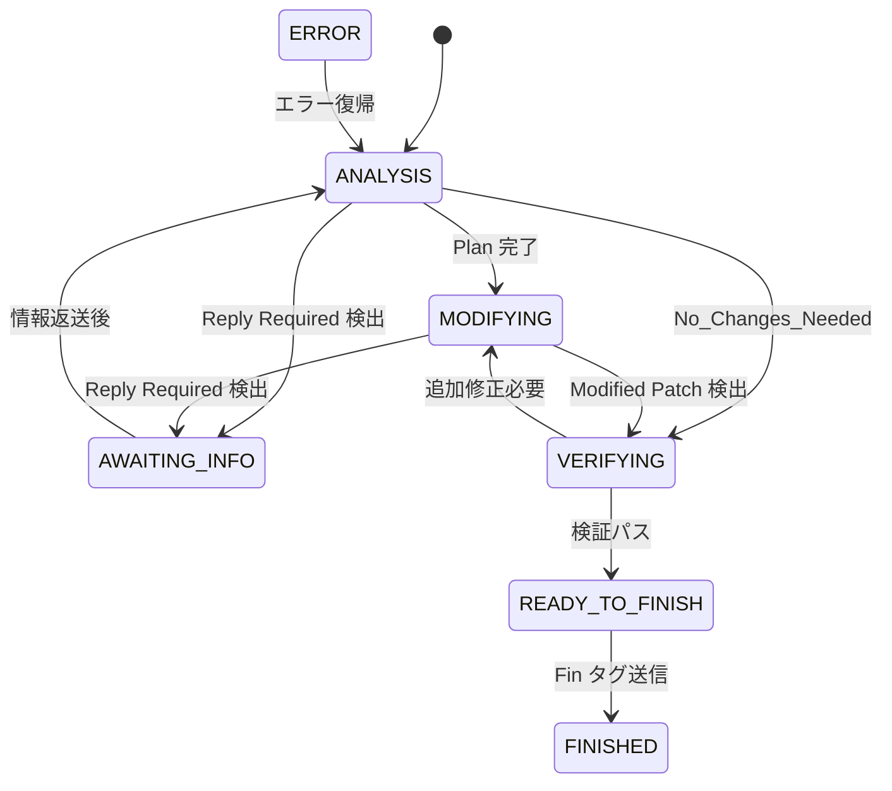

# FSM（有限状態機械）による LLM 対話制御

本ドキュメントでは、`experiment/fsm-implementation` ブランチ（論文投稿最終版）で実装された FSM の詳細を説明する。

> ブランチ間の FSM 実装の違いについては [branches.md](branches.md) を参照

---

## 概要

LLM との対話ループを **二重ステートマシン** で制御する。

1. **外部ステートマシン**（`State` enum in `src/modules/types.ts`）  
   — `llmFlowController.ts` の `run()` メソッド内の switch 文で処理フローを駆動する
2. **内部 FSM**（`AgentState` enum in `src/types/AgentState.ts`）  
   — LLM 応答のタグが現在の状態で有効かを検証し、不正なタグを無視・リトライする

---

## 外部ステートマシン（処理フロー）

```
State enum:
  Start
  → PrepareInitialContext     // 設定・モジュール初期化
  → SendInitialInfoToLLM      // 初期プロンプト送信
  → LLMAnalyzePlan            // LLM 応答解析
  → LLMDecision               // FSM 状態に基づく分岐（中核）
    ├── AWAITING_INFO
    │   → SystemAnalyzeRequest → GetFileContent / GetDirectoryListing
    │   → SendInfoToLLM → LLMReanalyze → LLMDecision (ループ)
    ├── MODIFYING
    │   → SystemParseDiff → SystemApplyDiff → CheckApplyResult
    │   → SendResultToLLM → LLMNextStep → LLMDecision (ループ)
    ├── VERIFYING
    │   → SendVerificationPrompt → LLMVerificationDecision
    │   → READY_TO_FINISH → FINISHED → End
    ├── ERROR
    │   → SendErrorToLLM → LLMErrorReanalyze → LLMDecision
    └── FINISHED → End
```

---

## 内部 FSM（AgentState）

### 状態一覧

| 状態 | 説明 | LLM に見える？ |
|------|------|:-------------:|
| `ANALYSIS` | 初期分析・計画立案フェーズ | ✅ |
| `AWAITING_INFO` | ファイル/ディレクトリ情報の取得待ち | ❌（内部専用） |
| `MODIFYING` | パッチ（diff）生成フェーズ | ✅ |
| `VERIFYING` | 自己検証・レビューフェーズ | ✅ |
| `READY_TO_FINISH` | 完了許可直前（内部状態） | ❌ |
| `FINISHED` | 正常終了（`%%_Fin_%%` 送信後） | — |
| `ERROR` | 異常系 | — |

### 状態遷移図



### 各状態で許可されるタグ

| 状態 | 許可タグ |
|------|----------|
| `ANALYSIS` | `%_Thought_%`, `%_Plan_%`, `%_Correction_Goals_%`, `%_Reply Required_%`, `%_No_Changes_Needed_%` |
| `AWAITING_INFO` | `%_Thought_%`（内部専用） |
| `MODIFYING` | `%_Modified_%`, `%_Reply Required_%` |
| `VERIFYING` | `%_Verification_Report_%`, `%_Thought_%`, `%_Modified_%` |
| `READY_TO_FINISH` | — |
| `FINISHED` | — |
| `ERROR` | `%_Thought_%`, `%_Reply Required_%` |

### 各状態で許可されるアクション

| 状態 | FILE_CONTENT | DIRECTORY_LISTING |
|------|:------------:|:-----------------:|
| `ANALYSIS` | ✅ | ✅ |
| `MODIFYING` | ✅ | ✅ |
| `ERROR` | ✅ | ✅ |
| その他 | ❌ | ❌ |

---

## 安全機構

| 機構 | 閾値 | 動作 |
|------|------|------|
| ターン数上限 | 15 ターン | 強制終了 |
| タグ違反リトライ | 最大 2 回 | 正しいタグを使うよう LLM に再依頼 |
| 調査フェーズ強制終了 | 連続 5 回のファイルリクエスト | 修正フェーズへ強制遷移 |
| No Progress 検出 | 同一状態 + 同一タグが 2 回連続 | 行き詰まり判定 → 強制遷移 |

---

## タグパーサー

`AgentStateMachine.ts` 内の `TagParser` ユーティリティクラスが LLM 応答のタグを解析する。

- **検出パターン**: `%_XXX_%` / `%%_XXX_%%`（正規表現）
- **タグ種別判定**: `isTag(tagName)` でタグ名の正当性を確認
- **コンテンツ抽出**: 開始タグと終了タグの間のテキストを抽出

---

## 関連ファイル

| ファイル | 役割 |
|---------|------|
| `src/modules/llmFlowController.ts` | メイン処理ループ（外部ステートマシン） |
| `src/modules/AgentStateMachine.ts` | FSM 低レベル実装 + TagParser |
| `src/types/AgentState.ts` | FSM 状態・遷移ルール・許可タグの定義 |
| `src/Service/AgentStateService.ts` | FSM ビジネスロジック（タグ正規化・次状態推測） |
| `src/modules/types.ts` | 外部 State enum・共通型定義 |
