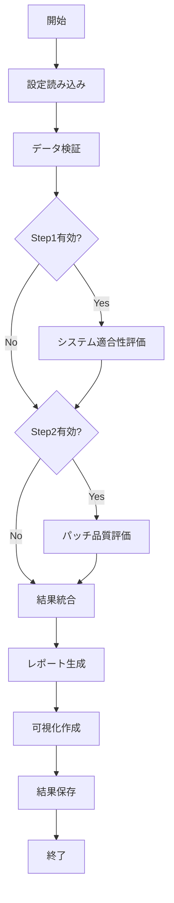
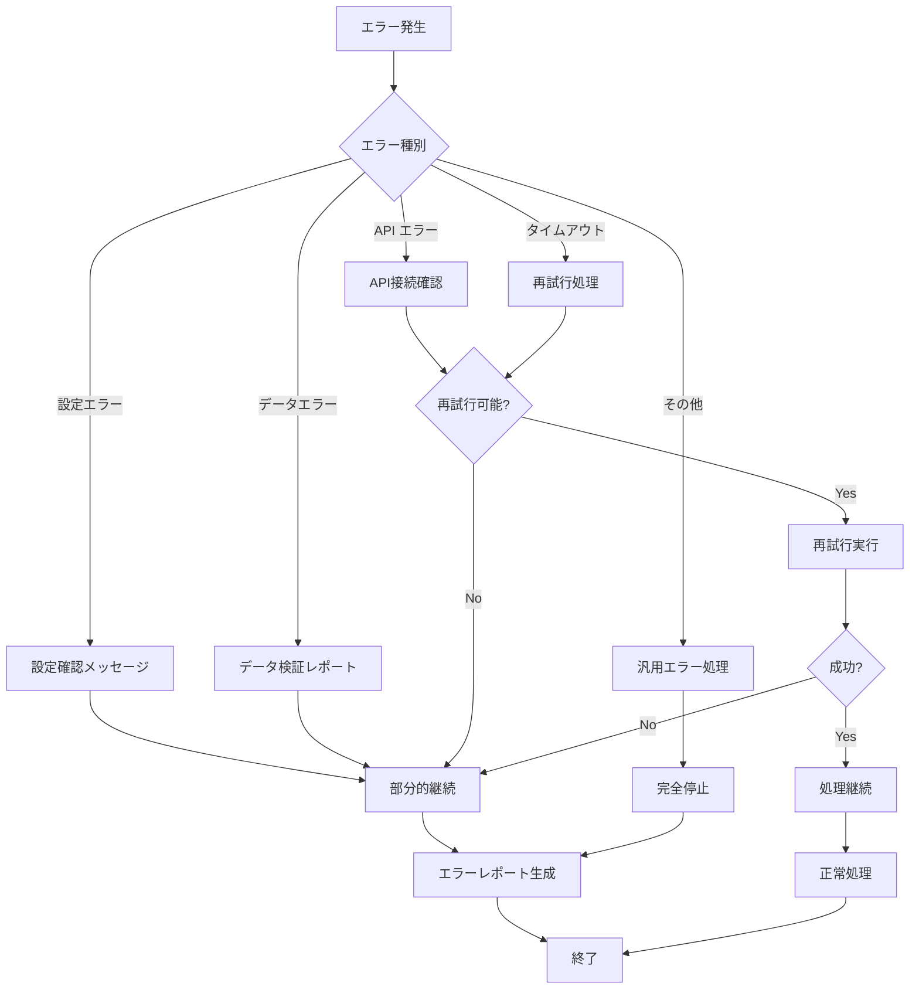

# APR評価システム 仕様書

## 📋 システム仕様概要

### システム名
**gRPC_Analyzer APR評価システム**

### 目的
LLMベースのAPR（Automatic Program Repair）システムが生成したパッチの品質を、グラウンドトゥルースと比較して定量的・定性的に評価する。

### バージョン
**v1.0**

### 最終更新日
**2025-07-22**

---

## 🎯 機能要件

### 主要機能

#### 1. 2段階評価フレームワーク

**Step 1: システム適合性評価**
- **制御フロー解析精度**: APRシステムのコード解析能力評価
- **パーサー正確性**: プログラム構文解析の精度測定
- **ファイル処理能力**: 多様なファイル形式への対応能力
- **エラーハンドリング**: 異常事態への対処能力

**Step 2: パッチ品質評価**
- **妥当性**: 構文・意味的正確性の評価
- **正確性R1-R10**: グラウンドトゥルースとの一致度（Rank-based）
- **推論品質**: LLMの推論プロセスの質的評価
- **意味的類似度**: セマンティックレベルでの比較

#### 2. LLM統合評価システム
- **OpenAI統合**: GPT-4, GPT-3.5-turboを使用した高度な評価
- **Anthropic統合**: Claude-3による多角的評価
- **プロンプト管理**: 評価用プロンプトテンプレートの管理・最適化
- **レート制限管理**: API呼び出し頻度の自動調整

#### 3. 統計分析・レポーティング
- **記述統計**: 基本統計量の算出
- **比較分析**: ベースラインとの比較評価
- **可視化**: グラフ・チャートによる結果可視化
- **トレンド分析**: 時系列での性能推移分析

#### 4. データ管理・処理
- **大量データ処理**: バッチ処理による効率的なデータ処理
- **並列処理**: マルチワーカーによる高速処理
- **キャッシング**: 中間結果の保存・再利用
- **データ検証**: 入力データの整合性確認

---

## 🏗️ 非機能要件

### 性能要件

| 項目 | 要件 | 測定方法 |
|------|------|----------|
| **応答時間** | 小規模評価(~50件): 5分以内<br>中規模評価(~500件): 30分以内<br>大規模評価(~1000件): 60分以内 | 実行時間測定 |
| **スループット** | 1件/秒以上の処理能力 | 単位時間あたりの処理件数 |
| **メモリ使用量** | 4GB以下での安定動作 | プロセスメモリ監視 |
| **CPU使用率** | 平均80%以下 | システムリソース監視 |

### 可用性要件

| 項目 | 要件 | 実装方法 |
|------|------|----------|
| **稼働率** | 99%以上 | エラーハンドリング、自動復旧 |
| **フォルトトレラント** | 部分的失敗でも継続実行 | 例外処理、チェックポイント |
| **復旧時間** | 自動復旧: 30秒以内 | ヘルスチェック、自動再試行 |

### セキュリティ要件

| 項目 | 要件 | 実装方法 |
|------|------|----------|
| **API Key保護** | 環境変数での管理 | Docker secrets, .env |
| **データアクセス制御** | 読み取り専用アクセス | Volume mount read-only |
| **ログセキュリティ** | 機密情報のマスキング | ログフィルタリング |

### 拡張性要件

| 項目 | 要件 | 実装方法 |
|------|------|----------|
| **プラグイン対応** | 新規評価メトリクス追加可能 | インターフェース設計 |
| **LLMプロバイダー拡張** | 新規プロバイダー追加可能 | プロバイダーファクトリーパターン |
| **出力形式拡張** | 新規レポート形式追加可能 | レポーター抽象化 |

---

## 🏛️ システムアーキテクチャ

### アーキテクチャ概要

```
┌─────────────────────────────────────────────────────────────┐
│                    Docker Compose                          │
│  ┌─────────────┐ ┌─────────────────┐ ┌─────────────────────┐ │
│  │     dev     │ │ grpc-analyzer   │ │  evaluation-system  │ │
│  │ (開発環境)   │ │     -node       │ │   (評価システム)      │ │
│  │             │ │  (APR本体)      │ │                     │ │
│  └─────────────┘ └─────────────────┘ └─────────────────────┘ │
└─────────────────────────────────────────────────────────────┘
                              │
                              ▼
┌─────────────────────────────────────────────────────────────┐
│                  ホストOS ファイルシステム                     │
│  F:/Workspace/gRPC_Analyzer/                               │
│  ├── dataset/          (データセット)                        │
│  ├── log/             (APRログ)                             │
│  ├── output/          (APR結果)                             │
│  └── evaluation/      (評価システム)                         │
│      ├── results/     (評価結果)                             │
│      └── logs/        (評価ログ)                             │
└─────────────────────────────────────────────────────────────┘
```

### 評価システム内部構造

```
evaluation-system コンテナ (/app/)
├── main.py                    # エントリーポイント
├── src/                       # ソースコード
│   ├── evaluators/           # 評価エンジン
│   │   ├── compliance_evaluator.py    # Step1評価
│   │   ├── quality_evaluator.py       # Step2評価
│   │   └── integrated_evaluator.py    # 統合評価
│   ├── analyzers/            # データ解析
│   ├── llm/                  # LLM統合
│   ├── reporters/            # レポート生成
│   └── utils/                # ユーティリティ
├── config/                   # 設定ファイル
├── evaluation-design/        # 評価設計資料
├── results/                  # 評価結果 (ホストマウント)
├── apr-logs/                 # APRログ (読み取り専用)
├── apr-output/               # APR結果 (読み取り専用)
└── dataset/                  # データセット (読み取り専用)
```

---

## 📊 データフロー仕様

### 入力データ仕様

#### 1. データセットファイル

**ファイル場所**: `/app/dataset/`

| ファイル名 | 形式 | 説明 | 必須フィールド |
|-----------|------|------|----------------|
| `gRPC_reps_list.csv` | CSV | プロジェクト一覧 | project_name, repository_url |
| `P.U_merged_filtered - Final_merged_only_not_excluded_yes_ms_unarchived_commit_hash v2.0.csv` | CSV | メインデータセット | commit_hash, project, file_path, ground_truth |

#### 2. APRログデータ

**ファイル場所**: `/app/apr-logs/{project_name}/`

| ファイル種別 | 形式 | 説明 |
|--------------|------|------|
| `issue/` | JSON | Issue解析ログ |
| `pullrequest/` | JSON | プルリクエスト解析ログ |

**ログエントリー例**:
```json
{
  "timestamp": "2025-07-22T10:30:00Z",
  "project": "servantes",
  "commit_hash": "abc123def456",
  "status": "success",
  "parsing_success": true,
  "control_flow_detected": true,
  "files_processed": 15,
  "errors": []
}
```

#### 3. APR結果データ

**ファイル場所**: `/app/apr-output/`

| ファイル種別 | 形式 | 説明 |
|--------------|------|------|
| `processing_summary_*.json` | JSON | 処理サマリー |
| `error_report_*.json` | JSON | エラーレポート |
| `tmp_restoredDiff.txt` | TEXT | 生成パッチ |

### 出力データ仕様

#### 1. 評価結果レポート

**ファイル場所**: `/app/results/`

**JSONレポート例**:
```json
{
  "evaluation_summary": {
    "timestamp": "2025-07-22T10:30:00Z",
    "total_evaluations": 150,
    "successful_evaluations": 142,
    "failed_evaluations": 8,
    "average_execution_time": 45.2
  },
  "compliance_metrics": {
    "control_flow_accuracy": 0.87,
    "parser_success_rate": 0.92,
    "file_processing_rate": 0.89,
    "error_handling_score": 0.85,
    "overall_compliance": 0.88
  },
  "quality_metrics": {
    "plausibility_score": 0.76,
    "correctness_r1": 0.23,
    "correctness_r5": 0.45,
    "correctness_r10": 0.58,
    "reasoning_quality": 0.72,
    "overall_quality": 0.55
  },
  "detailed_results": [...]
}
```

#### 2. 統計チャート

**ファイル場所**: `/app/results/charts/`

| チャート種別 | フォーマット | 説明 |
|--------------|--------------|------|
| メトリクス分布 | PNG/PDF | ヒストグラム、箱ひげ図 |
| プロジェクト比較 | PNG/PDF | バーチャート |
| 時系列トレンド | PNG/PDF | 線グラフ |
| 相関分析 | PNG/PDF | 散布図、ヒートマップ |

---

## ⚙️ 設定仕様

### 環境変数

| 変数名 | 必須 | デフォルト | 説明 |
|--------|------|-----------|------|
| `PYTHONPATH` | ✓ | `/app` | Pythonパス |
| `EVALUATION_MODE` | ✓ | `production` | 実行モード |
| `OPENAI_API_KEY` | ○ | - | OpenAI APIキー |
| `ANTHROPIC_API_KEY` | ○ | - | Anthropic APIキー |
| `LOG_LEVEL` | ✗ | `INFO` | ログレベル |

### 設定ファイル

**`config/evaluation_config.json`**:
```json
{
  "evaluation": {
    "step1_enabled": true,
    "step2_enabled": true,
    "llm_provider": "openai",
    "model": "gpt-4",
    "timeout": 300,
    "max_retries": 3,
    "batch_size": 10,
    "parallel_workers": 4
  },
  "output": {
    "format": "json",
    "include_charts": true,
    "chart_format": "png",
    "include_raw_data": false
  },
  "data": {
    "dataset_filters": {
      "min_file_size": 100,
      "max_file_size": 100000,
      "supported_extensions": [".proto", ".go", ".java", ".py"]
    },
    "processing": {
      "chunk_size": 50,
      "memory_limit_mb": 2048
    }
  },
  "logging": {
    "level": "INFO",
    "file_rotation": true,
    "max_file_size": "10MB",
    "backup_count": 5,
    "log_format": "%(asctime)s - %(name)s - %(levelname)s - %(message)s"
  }
}
```

---

## 🔄 プロセス仕様

### 評価実行プロセス



### エラーハンドリングプロセス



---

## 🧪 テスト仕様

### テストレベル

#### 1. 単体テスト
- **対象**: 個別クラス・メソッド
- **カバレッジ**: 80%以上
- **実行時間**: 5分以内
- **テストデータ**: モックデータ使用

#### 2. 統合テスト
- **対象**: モジュール間連携
- **シナリオ**: 実際の評価フロー
- **実行時間**: 15分以内
- **テストデータ**: サンプルデータセット使用

#### 3. パフォーマンステスト
- **対象**: システム全体
- **負荷レベル**: 小・中・大規模データ
- **監視項目**: 実行時間、メモリ使用量、CPU使用率

#### 4. エンドツーエンドテスト
- **対象**: 完全な評価パイプライン
- **環境**: 本番環境相当
- **検証項目**: 結果正確性、レポート品質

### テストケース

#### システム適合性評価テスト

| テストケース | 入力 | 期待結果 |
|--------------|------|----------|
| 正常ログ処理 | 完全なAPRログ | 精度スコア 0.8以上 |
| 部分ログ処理 | 一部欠損ログ | 部分評価継続 |
| 異常ログ処理 | 破損ログ | エラーハンドリング |

#### パッチ品質評価テスト

| テストケース | 入力 | 期待結果 |
|--------------|------|----------|
| 完全一致パッチ | 同一パッチ | Correctness@1 = 1.0 |
| 部分一致パッチ | 類似パッチ | 0.5 < スコア < 1.0 |
| 不一致パッチ | 異なるパッチ | スコア < 0.3 |

---

## 📋 運用仕様

### デプロイメント要件

#### 環境要件
- **OS**: Linux (Debian 11推奨)
- **コンテナ**: Docker 20.0+, Docker Compose 2.0+
- **メモリ**: 4GB以上
- **ストレージ**: 10GB以上の空き容量
- **ネットワーク**: インターネット接続 (LLM API用)

#### デプロイ手順
1. **リポジトリクローン**
2. **環境変数設定**
3. **コンテナビルド**: `./manage.sh build`
4. **設定確認**: `./manage.sh eval-setup`
5. **テスト実行**: `./manage.sh eval-dry-run`

### 監視・メンテナンス

#### 監視項目

| 項目 | 監視方法 | アラート閾値 |
|------|----------|--------------|
| **CPU使用率** | `docker stats` | 90%超過 |
| **メモリ使用量** | プロセス監視 | 3.5GB超過 |
| **ディスク使用量** | `df -h` | 80%超過 |
| **API応答時間** | アプリケーションログ | 10秒超過 |
| **エラー率** | ログ解析 | 5%超過 |

#### ログローテーション
- **ローテーション**: 日次
- **保存期間**: 30日
- **最大ファイルサイズ**: 10MB
- **バックアップ数**: 5ファイル

#### バックアップ戦略
- **評価結果**: 週次バックアップ
- **設定ファイル**: Git管理
- **ログファイル**: 月次アーカイブ

---

## 🔒 セキュリティ仕様

### データ保護

#### アクセス制御
- **データセット**: 読み取り専用マウント
- **APRログ/結果**: 読み取り専用マウント
- **評価結果**: 評価システムのみ書き込み可能

#### 機密情報管理
- **API Key**: 環境変数・Docker secrets
- **ログ**: 機密情報自動マスキング
- **レポート**: 個人情報除外

### API セキュリティ

#### レート制限
- **OpenAI**: 100リクエスト/分
- **Anthropic**: 50リクエスト/分
- **自動調整**: 429エラー時のバックオフ

#### エラーハンドリング
- **API Key無効**: 代替プロバイダー使用
- **ネットワークエラー**: 指数バックオフ再試行
- **レート制限**: 待機後再実行

---

## 📈 パフォーマンス仕様

### ベンチマーク

#### 標準性能指標

| データ規模 | 処理件数 | 実行時間 | メモリ使用量 | CPU使用率 |
|-----------|----------|----------|-------------|-----------|
| **小規模** | 50件 | 5分以内 | 1GB以下 | 60%以下 |
| **中規模** | 500件 | 30分以内 | 2GB以下 | 75%以下 |
| **大規模** | 1000件 | 60分以内 | 3GB以下 | 80%以下 |

#### 最適化戦略

1. **並列処理**
   - ワーカー数: CPU コア数と同等
   - バッチサイズ: メモリ容量に応じて調整

2. **キャッシング**
   - LLM応答: ハッシュベースキャッシュ
   - 中間結果: ファイルベースキャッシュ

3. **メモリ管理**
   - ガベージコレクション: 定期実行
   - 大量データ: チャンク処理

---

## 🔧 保守・拡張仕様

### 機能拡張ポイント

#### 1. 新規評価メトリクス
- **インターフェース**: `BaseEvaluator`継承
- **登録方法**: `IntegratedEvaluator`に追加
- **設定**: `evaluation_config.json`で有効化

#### 2. LLMプロバイダー追加
- **インターフェース**: `BaseLLMProvider`継承
- **ファクトリー**: `provider_factory.py`に登録
- **設定**: プロバイダー名で切り替え

#### 3. レポート形式追加
- **インターフェース**: `BaseReporter`継承
- **出力**: 新形式での結果出力
- **可視化**: カスタムチャート作成

### バージョン管理

#### セマンティックバージョニング
- **MAJOR**: 破壊的変更
- **MINOR**: 機能追加
- **PATCH**: バグ修正

#### 互換性保証
- **設定ファイル**: 後方互換性維持
- **API**: 廃止予定機能の段階的削除
- **データ形式**: マイグレーション機能提供

---

## 📞 サポート・メンテナンス

### トラブルシューティング

#### よくある問題

1. **メモリ不足**
   - **原因**: 大量データ処理時のメモリリーク
   - **対処**: バッチサイズ削減、ワーカー数調整

2. **API制限**
   - **原因**: LLM APIのレート制限
   - **対処**: 待機時間増加、プロバイダー切り替え

3. **パス関連エラー**
   - **原因**: ホストパスのマウント失敗
   - **対処**: docker-compose.yml確認、パス修正

### 問い合わせ先

- **技術的問題**: 開発チーム
- **設定関連**: システム管理者
- **データ問題**: データ管理者

### 更新履歴

| バージョン | 日付 | 変更内容 |
|-----------|------|----------|
| v1.0 | 2025-07-22 | 初版リリース |

---

**文書管理**:
- **作成者**: APR評価システム開発チーム
- **承認者**: プロジェクトマネージャー
- **分類**: 内部技術文書
- **配布先**: 開発チーム、運用チーム
